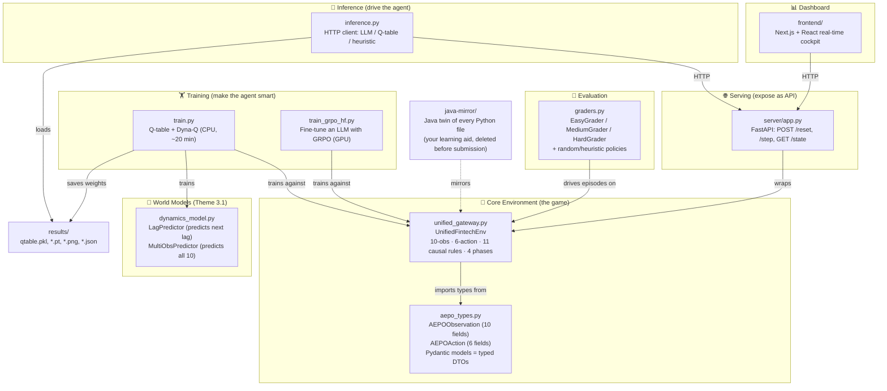

# 01 — Project Overview

> **Goal of this document:** After reading this, you can explain *what AEPO is*, *what problem it solves*, *why it exists*, and *how the big pieces fit together* — without looking at any code.

## Table of Contents

1. [What is AEPO, in one paragraph](#1-what-is-aepo-in-one-paragraph)
2. [The real-world problem it models](#2-the-real-world-problem-it-models)
3. [Why this is a Reinforcement Learning problem (not normal code)](#3-why-this-is-a-reinforcement-learning-problem-not-normal-code)
4. [The hackathon context & themes](#4-the-hackathon-context--themes)
5. [The whole system on one page](#5-the-whole-system-on-one-page)
6. [The technology stack at a glance](#6-the-technology-stack-at-a-glance)
7. [What "good" looks like — the results](#7-what-good-looks-like--the-results)
8. [The headline stories you will tell](#8-the-headline-stories-you-will-tell)
9. [Key takeaways](#9-key-takeaways)

---

## 1. What is AEPO, in one paragraph

**AEPO (Autonomous Enterprise Payment Orchestrator)** is a **simulator of a UPI payment gateway under stress**, plus the **machinery to train an AI agent to operate that gateway well**. The simulator pretends to be a real production payment system: it has Kafka consumer lag, bank-API latency, fraud risk scores, database connection pools, and SLA targets. On every simulated tick it shows an agent 10 live metrics and asks the agent to make 6 operational decisions (approve/reject the transaction, verify or skip crypto, throttle or circuit-break the infra, etc.). It then scores that decision from 0.0 to 1.0. The agent's job is to learn a *policy* — a strategy — that keeps the score high across an entire 100-tick episode, even as the simulator escalates the difficulty in response to the agent getting better.

☕ **Java analogy:** Imagine you wrote a `PaymentGatewaySimulator` Spring service with a `StepResult step(ActionDto action)` method. The simulator holds internal state (lag counters, latency EMAs, fraud flags) in private fields and mutates them on each call, returning a DTO with the new metrics + a score. AEPO is that simulator, plus a "client" (the agent) that learns — by trial and error over millions of calls — which `ActionDto` to send in each situation to maximize the total score. The novel part isn't the simulator; it's that *the client is not hand-coded — it learns*.

---

## 2. The real-world problem it models

In real UPI infrastructure (you know this world better than most), two teams operate the same pipeline but are **blind to each other**:

- The **Fraud / Risk team** decides whether to approve, reject, or challenge each transaction. When a botnet attacks, they reject aggressively. But every rejected transaction *still consumed a Kafka slot, a DB connection, a verification cycle*. They don't see the infra cost of their decisions.
- The **SRE / Infra team** decides whether to throttle traffic, open circuit breakers, change retry policies. When lag spikes, they throttle. But 90% of that throttled traffic during an attack is malicious — they're spending capacity protecting fraud. They don't see the risk profile of what they're throttling.

No single static rulebook can balance **fraud safety**, **infrastructure health**, and **latency SLA** simultaneously, because the right trade-off changes second by second. The three failure modes AEPO models:

```
┌────────────────────────────────────────────────────────────┐
│                 THE THREE FAILURE MODES                     │
│                                                            │
│  ① KAFKA LAG EXPLOSION                                     │
│     Consumer lag > 4,000 msgs → system CRASH (episode ends)│
│     Cause: flash sales, botnet volume, blind routing       │
│                                                            │
│  ② P99 SLA BREACH                                          │
│     Rolling latency > 800 ms → penalty + merchant churn    │
│     Cause: crypto overhead, accumulating latency debt      │
│                                                            │
│  ③ FRAUD BYPASS                                            │
│     Skip verification on a high-risk txn → episode ends    │
│     Cause: cutting corners for speed under pressure        │
└────────────────────────────────────────────────────────────┘
```

**AEPO's thesis:** a single autonomous agent that sees *all three planes at once* can find trade-offs that two siloed rulebooks never could. The project builds the simulated world where such an agent can be trained and measured.

💡 **Interview tip:** When asked "why is this interesting?", lead with the *coordination problem* (fraud vs infra blindness), not the ML. The ML is the *solution*; the coordination failure is the *problem*. Interviewers reward candidates who frame ML work as solving a real problem.

---

## 3. Why this is a Reinforcement Learning problem (not normal code)

You could try to solve "operate the gateway" with a giant `if/else` rulebook (that's exactly what the **heuristic** in this project is). So why use RL?

Because the decisions have **delayed, causal consequences**, and the optimal action depends on a *future* you can't see yet:

- **Throttling now** reduces Kafka lag **two steps later** (not immediately). A rulebook reacting to *current* lag is always behind.
- **Skipping crypto verification** saves 250 lag-units *per step* — a benefit that compounds across the whole episode, not just now.
- **The environment fights back**: as the agent gets better, an internal adversary escalates pressure. A fixed rulebook can't adapt; a learner can.

This is the textbook definition of a **sequential decision problem under delayed reward** — exactly what Reinforcement Learning was invented for. (Document 03 explains RL from absolute zero. Document 07 shows precisely how AEPO maps onto RL.)

☕ **Java analogy:** A normal program is a pure function: `output = f(input)`, deterministic and stateless-ish. RL is more like writing a **bot for a strategy game** where a move you make now only pays off 10 turns later, and the opponent adapts to your style. You can't hand-write the perfect strategy table — it's too big and too dynamic — so you let the bot *learn* it by playing.

---

## 4. The hackathon context & themes

AEPO is a submission to the **Meta PyTorch OpenEnv Hackathon × Scaler School of Technology** (Grand Finale, top 800 of 31,000+ registrations). It is the evolution of a Round-1 project called **UFRG (Unified Fintech Risk Gateway)**.

**OpenEnv** is the hackathon's standard for "an environment an AI can be trained against." Think of it as an **interface contract** (like implementing a specific Java interface so a framework can call your class generically). AEPO implements that contract so the judges' automated graders can drive it. (Doc 10 covers OpenEnv in detail.)

The submission deliberately targets specific judging **themes**:

| Theme | What it asks for | How AEPO delivers it | Code anchor |
|-------|------------------|----------------------|-------------|
| **#3.1 World Modeling** (primary) | The agent should *learn a model of how the world behaves*, not just react | A neural net (`LagPredictor`) learns to predict the next Kafka lag, and that prediction is *used* both in training (Dyna-Q planning) and at inference (infra override) | `dynamics_model.py`, `train.py` `DynaPlanner`, `inference.py` `_model_based_infra_override` |
| **#4 Self-Improvement** (secondary) | The system should get better over time / push itself | An internal adversary escalates difficulty as the agent improves, producing the "staircase" curve | `unified_gateway.py` adversary escalation + `AdversaryPolicy` |
| **Causal Reasoning** | Decisions should have real consequences over time | 11 hand-built causal transitions (lag→latency, throttle relief delayed 2 steps, etc.) | `unified_gateway.py` `step()` |
| **Realistic Env Design** | Not a toy | A 10-signal, 6-action UPI gateway with asymmetric fraud/infra/SLA trade-offs | whole env |
| **Deployment Efficiency** | Runs cheaply | CPU-only PyTorch, `python:3.10-slim`, fits 2 vCPU / 8 GB | `Dockerfile`, `requirements.txt` |

🔧 **Technical reality:** "World model" here means a small **neural network** that learned the function `next_kafka_lag = f(current_state, action)`. "Self-improvement" means there's a tiny second **Q-learning policy** (the adversary) whose reward is the *negative* of the agent's reward — so they're adversaries.

🎤 **Pitch framing:** "a learned world model wired into planning and inference" and "an adversarial environment that escalates difficulty based on defender performance." Same thing, judge-friendly words.

---

## 5. The whole system on one page

Here is every moving part and how they relate. Don't worry about understanding each box yet — Doc 04 expands this. Just absorb the *shape*.



**Read it as a story:** `aepo_types.py` defines the data contracts. `unified_gateway.py` is the game built on those contracts. `graders.py` scores how well any strategy plays. `train.py` plays the game thousands of times to *learn* a good strategy and trains the `dynamics_model.py` world models alongside, saving everything to `results/`. `server/app.py` wraps the game as a REST API. `inference.py` is the client that plays the game through that API using a chosen strategy. `frontend/` is a live dashboard. `java-mirror/` is a Java translation of everything — built specifically so a Java engineer (you) can read the logic in a familiar language.

---

## 6. The technology stack at a glance

Each of these gets a full "what/why/alternatives" treatment in later docs (especially Doc 10). Here's the map with Java equivalents so nothing is a black box:

| Technology | What it is (1 line) | Java world equivalent | Where used |
|------------|---------------------|------------------------|------------|
| **Python 3.10** | The programming language everything is written in | Java (the language itself) | everywhere |
| **pip / requirements.txt** | Installs libraries | Maven / `pom.xml` | `requirements.txt` |
| **uv / pyproject.toml** | A faster, modern package manager + project metadata | Gradle + `build.gradle` | `pyproject.toml`, `uv.lock` |
| **virtual environment (`.venv`)** | Isolated per-project library folder | a project-local `.m2`, or a container's classpath | `.venv/` |
| **Pydantic v2** | Typed, self-validating data models | Bean Validation (`@Valid`, JSR-380) on a `record` | `aepo_types.py` |
| **Gymnasium** | The standard RL "environment" interface | A framework interface you implement (like `WebMvcConfigurer`) | `unified_gateway.py` |
| **NumPy** | Fast numeric arrays & math | `double[]` + a math library, but vectorized | everywhere numeric |
| **PyTorch** | Build & train neural networks | (No clean Java equivalent; closest: DJL/DL4J) | `dynamics_model.py` |
| **FastAPI** | Web framework for REST APIs | Spring Boot `@RestController` | `server/app.py` |
| **Uvicorn** | The web server that runs FastAPI | Embedded Tomcat under Spring Boot | `server/app.py`, Dockerfile |
| **httpx** | HTTP client (async) | `WebClient` / `RestTemplate` | `inference.py` |
| **OpenAI SDK** | Client to talk to an LLM over HTTP | any vendor SDK | `inference.py` |
| **TRL + Unsloth** | Libraries to fine-tune LLMs with RL | (no equivalent) | `train_grpo_hf.py` |
| **pytest** | Test framework | JUnit | `tests/` |
| **Docker** | Package the app + deps into a container | Docker (same!) | `Dockerfile` |
| **Hugging Face Spaces** | Free hosting for the container | a PaaS like Heroku/Cloud Run | deployment target |
| **OpenEnv** | The hackathon's env interface spec + CLI | a certification/contract + its TCK | `openenv.yaml` |
| **Next.js / React / TypeScript** | The dashboard front-end | Angular/React SPA on a Spring backend | `frontend/` |

---

## 7. What "good" looks like — the results

The point of all the machinery is a single comparison: **does the trained agent beat the baselines?** Here are the documented headline numbers (from `README.md`, reproduced by `python train.py`). Scores are mean reward per step over 10 evaluation episodes, where a crashed episode is padded with 0.0 for its remaining steps.

| Task | Random policy | Heuristic (hand-coded SRE rulebook) | **Trained Q-table** | Pass threshold | Pass? |
|------|:---:|:---:|:---:|:---:|:---:|
| `easy` | 0.4977 | 0.7623 | **0.76** | ≥ 0.75 | ✅ |
| `medium` | 0.5467 | 0.3940 | **0.63** | ≥ 0.45 | ✅ |
| **`hard`** | **0.2507** | **0.2955** | **0.6650** | **≥ 0.30** | ✅ **(2.25× the heuristic)** |

The flagship result: on the **hard task** (sustained botnet attack), the trained agent scores **0.6650 vs the heuristic's 0.2955 — a 2.25× improvement**. That gap is the entire pitch: *the agent learned trade-offs the expert rulebook missed.*

Three policies you'll keep hearing about:
- **Random** — picks actions uniformly at random. The floor. Proves the task isn't trivially solvable.
- **Heuristic** — a hand-coded "senior SRE first-pass rulebook" with **3 deliberate blind spots**. It's the honest, competent baseline.
- **Trained** — learned a Q-table by playing 2000+ episodes. It *finds* the 3 blind spots and exploits them.

💡 **Interview tip:** Memorize "**hard: 0.6650 trained vs 0.2955 heuristic, 2.25×**." A single concrete, defensible number beats vague claims of "it works well."

---

## 8. The headline stories you will tell

Four stories carry the whole presentation. Each is backed by code and a saved artifact, so they survive scrutiny.

1. **The Blind-Spot Discovery (your #1 story).** The heuristic always does *FullVerify* when it rejects a high-risk transaction — sensible, but FullVerify adds ~150ms latency / 250 lag-units per step. The trained agent *discovered* that **Reject + SkipVerify is equally safe and far cheaper**. First recorded at **training episode 335, step 41** (saved in `results/blind_spot_events.json`). *"That's not a rule we programmed — it's something the agent learned."*

2. **The Staircase (Self-Improvement / Theme #4).** As the agent's rolling reward climbs, the internal adversary raises `adversary_threat_level`, making the game harder, so reward dips, then the agent adapts and climbs again. The saved chart `results/reward_staircase.png` shows this saw-tooth — visual proof of recursive self-improvement.

3. **The World Model Is Load-Bearing (Theme #3.1).** Skeptics say "you trained a neural net but nothing uses it." AEPO uses it twice: in training, `DynaPlanner` runs 5 *imagined* practice updates per real step using the `LagPredictor`'s predictions; at inference, when lag is near the crash cliff, the model is queried for all 3 routing options and picks the one with lowest predicted next-lag. (`results/dyna_comparison.png` shows it speeds up learning.)

4. **Anti-Reward-Hacking (rigor).** Every shortcut an agent might exploit (always circuit-break, always reject, always defer settlement) is explicitly penalized. *"There are no free actions."* This is what separates a serious environment from a toy.

---

## 9. Key takeaways

- AEPO = **a simulated UPI gateway (environment)** + **the training/serving tooling to make an AI operate it well (agent)**.
- The real problem is **fraud-vs-infra coordination blindness**; RL is the chosen solution because decisions have **delayed, causal consequences** and the world **adapts**.
- The agent–environment **request/response loop** (action → observation+reward) repeated 100 times = one **episode**; thousands of episodes = **training**.
- Targets two judging themes: **World Modeling** (a neural net that predicts the future and is actually used) and **Self-Improvement** (an adversary that escalates difficulty).
- Flagship number: **hard task 0.6650 trained vs 0.2955 heuristic (2.25×)**.
- Four stories: **blind-spot discovery**, **the staircase**, **load-bearing world model**, **anti-reward-hacking**.

### Summary

You now have the whole project as a single mental image: a game we built, a player that learns it, a world that fights back, and measured proof the player wins. Everything in the remaining documents is *detail* hung on this frame. Next, before we touch any code, we close your two biggest knowledge gaps: **Python** (Doc 02) and **Reinforcement Learning** (Doc 03).

➡️ Next: [02_Python_For_Java_Developers.md](02_Python_For_Java_Developers.md)
