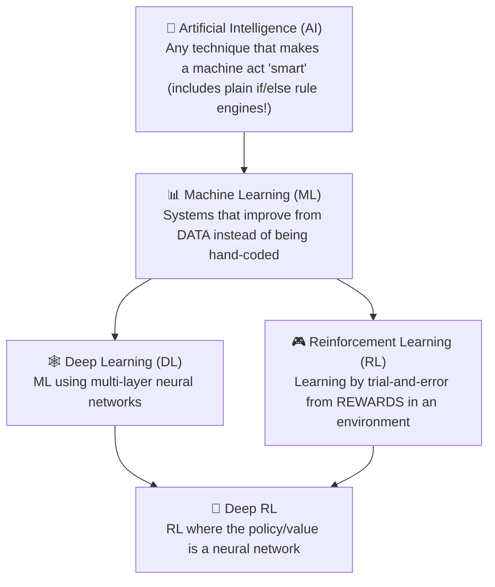
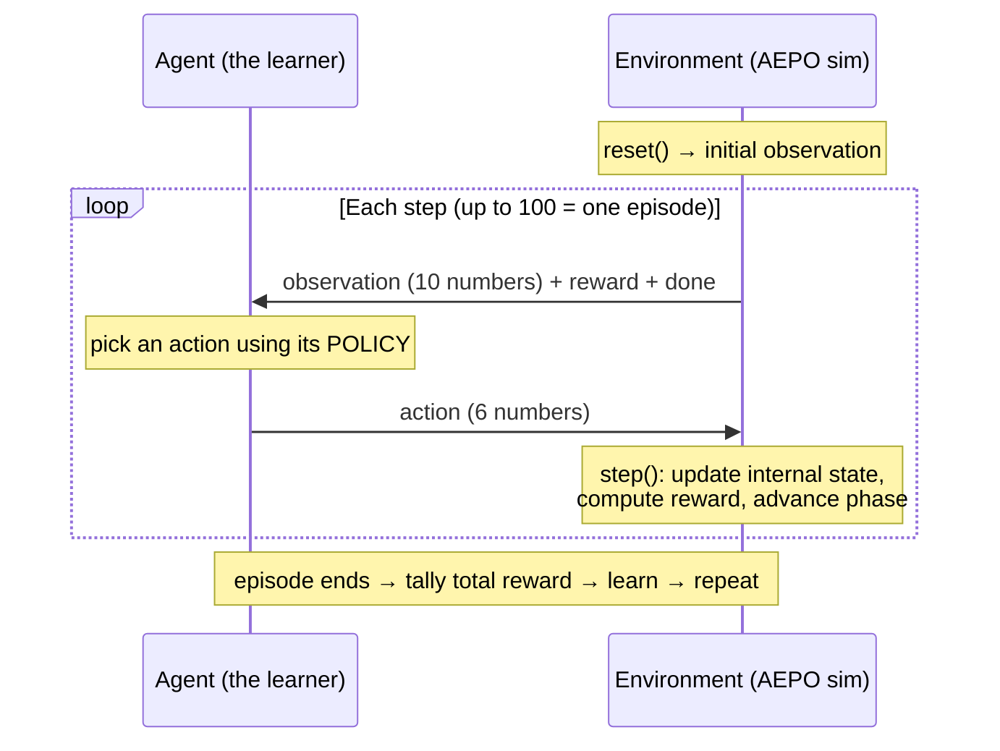

# 03 — Reinforcement Learning From Scratch

> **Goal:** Assume you've never studied AI. By the end you'll understand every RL term used in AEPO — agent, environment, observation, action, reward, policy, episode, step, value, Q-value, discount, exploration/exploitation, training vs inference, neural networks — and *why* RL was the right tool. Everything is grounded in AEPO and tied to Java where possible.

## Table of Contents

1. [The nested dolls: AI ⊃ ML ⊃ Deep Learning ⊃ (and beside it) RL](#1-the-nested-dolls)
2. [What is Machine Learning, really?](#2-what-is-machine-learning-really)
3. [The three flavors of ML (and which one RL is)](#3-the-three-flavors-of-ml)
4. [Reinforcement Learning: the core loop](#4-reinforcement-learning-the-core-loop)
5. [The vocabulary, one term at a time](#5-the-vocabulary-one-term-at-a-time)
6. [Value, Q-value, and the discount factor](#6-value-q-value-and-the-discount-factor)
7. [Exploration vs exploitation](#7-exploration-vs-exploitation)
8. [How learning actually happens: Q-learning & the Bellman update](#8-how-learning-actually-happens-q-learning--the-bellman-update)
9. [Neural networks & deep learning, minimally](#9-neural-networks--deep-learning-minimally)
10. [Training vs inference](#10-training-vs-inference)
11. [World models (Theme 3.1) in plain words](#11-world-models-theme-31-in-plain-words)
12. [Why RL instead of a normal rulebook?](#12-why-rl-instead-of-a-normal-rulebook)
13. [Key takeaways](#13-key-takeaways)

---

## 1. The nested dolls

These words get thrown around interchangeably. They are not the same. Here's the containment:



- **AI** is the broad umbrella: *anything* that makes software seem intelligent. Your hand-coded `heuristic_policy` in AEPO is technically "AI" (a rule-based expert system). No learning required.
- **Machine Learning** is the subset where the system *learns from data* rather than being told the rules. You give it examples; it infers the rule.
- **Deep Learning** is ML where the model is a **neural network** with multiple layers (the `LagPredictor` MLP in AEPO).
- **Reinforcement Learning** is a *different branch* of ML: instead of learning from a fixed dataset of labeled examples, the system **learns by acting in an environment and receiving rewards**.
- **Deep RL** is the overlap: RL where the decision-maker is a neural network.

☕ **Java analogy:** "AI" is like the word "framework" — huge and vague. "ML" is "frameworks that configure themselves from data." "Deep Learning" is "a specific kind of self-configuring framework built from layered math." "RL" is "a framework that learns the right behavior by being scored as it runs." AEPO's main agent is RL (a Q-table); its world model is Deep Learning (a neural net). They work together.

---

## 2. What is Machine Learning, really?

A normal program: **you write the rules**, data flows through them.
```
Rules + Data  ──►  Program  ──►  Answers
```
Machine Learning **flips it**: you provide data *and the answers*, and the machine **produces the rules**.
```
Data + Answers  ──►  ML Training  ──►  Rules (a "model")
```
Then you use those learned rules on new data:
```
New Data  ──►  Model  ──►  Predicted Answer
```

**Concrete example (not RL — just ML):** to detect fraud, instead of hand-writing `if amount > X && country != home → fraud`, you feed an ML model **100,000 past transactions each labeled fraud/not-fraud**, and it *learns* the boundary itself. The output is a "model" — a blob of learned numbers that maps input → prediction.

☕ **Java analogy:** Normal coding is writing the `if/else` yourself. ML is like having a system that *watches thousands of labeled examples and writes the `if/else` (well, the math) for you*. The "model" is the compiled-from-data ruleset; you can't easily read it, but you can call it.

⚠️ A "**model**" in ML just means "the learned thing you call to get predictions." In AEPO there are several: the **Q-table** (the agent's learned strategy), the **LagPredictor** (a learned predictor of future lag), and optionally a **fine-tuned LLM**. All are "models."

---

## 3. The three flavors of ML

| Flavor | You give it… | It learns to… | Everyday example | In AEPO? |
|--------|--------------|----------------|------------------|----------|
| **Supervised** | inputs **with correct answers** (labels) | map input → label | spam detection, fraud labels | The world models are *supervised-style* (predict next lag, with the real next lag as the label) |
| **Unsupervised** | inputs **with no answers** | find structure/clusters | customer segmentation | not used |
| **Reinforcement** | an **environment + reward signal** (no labels) | choose **actions** that maximize cumulative reward | game-playing bots, robot control, this project | The **agent** (Q-table / LLM) is pure RL |

The crucial difference for AEPO: **there is no dataset of "correct actions."** Nobody knows the perfect 6-decision action for every one of the trillions of possible states. So we can't do supervised learning. Instead, we let the agent *try* actions, *score* them with the reward function, and *reinforce* what scored well. That's RL.

☕ **Java analogy:** Supervised learning is like writing unit tests with known expected outputs and tuning code until they pass. RL is like writing a bot for a game where there's no answer key — you only get a *score*, and you must figure out which moves raise it. You learn from the scoreboard, not from a solutions manual.

---

## 4. Reinforcement Learning: the core loop

RL is a conversation between two parties — the **agent** (the learner/decider) and the **environment** (the world it acts in) — repeated over and over:



In code, this loop *is* the entire interaction (from `graders.py`):
```python
obs, _ = env.reset(seed=ep_seed, options={"task": task})   # start a game
done = False
while not done:
    action = policy_fn(obs.normalized())      # AGENT decides
    obs, reward, done, info = env.step(action)  # ENVIRONMENT responds
    step_rewards.append(reward)                 # remember the score
```

That five-line loop is the heart of *all* RL. Everything else — Q-tables, neural nets, GRPO, world models — is just *different ways of producing `action` from `obs`* and *different ways of using `reward` to improve next time*.

☕ **Java analogy:** It's a client–server request/response loop. The agent is the client; `env` is a stateful server with one endpoint, `step(action)`, that returns `(obs, reward, done, info)`. The client keeps calling until the server says `done`. The twist: the client *rewrites its own decision logic* based on the rewards it got.

---

## 5. The vocabulary, one term at a time

Now the precise definitions, each mapped to AEPO and to Java.

### Environment
The world the agent acts in — it holds state and responds to actions. In AEPO, the environment is the class `UnifiedFintechEnv` in `unified_gateway.py`. It simulates the payment gateway.
☕ A stateful service with internal fields and a `step()` method.

### Agent
The decision-maker that observes and acts. In AEPO the agent is *whatever produces actions*: the random policy, the heuristic policy, the trained Q-table, or an LLM. The environment doesn't know or care which — it just receives an `AEPOAction`.
☕ The client calling `step()` in a loop.

### State vs Observation (an important distinction)
- **State** = the *complete* internal situation of the environment. AEPO's true state includes hidden things the agent can't see: the exact internal `_kafka_lag` accumulator, the throttle-relief queue, the diurnal clock, the real `merchant_tier` when it's masked.
- **Observation** = the *slice of state the agent is allowed to see*. In AEPO that's the **10 numbers** in `AEPOObservation`, and even those are deliberately *noisy* and sometimes *masked*.

When the agent can't see the full state, the problem is a **POMDP** (Partially Observable Markov Decision Process). AEPO is intentionally a POMDP: it adds Gaussian noise to lag/latency, hides `merchant_tier` 30% of the time, and never shows the diurnal clock. This forces *robust* strategies instead of memorizing a clean signal.
☕ State = all private fields of the service. Observation = the DTO you expose over the API (a filtered, noisy projection). The client only ever sees the DTO.

### Observation space
The *shape and bounds* of what the agent can observe. AEPO's is a `Box(10,)` — a 10-dimensional vector of floats with defined min/max per dimension. (Doc 07 lists all 10.)
☕ The schema of the response DTO (10 typed fields with `@Min/@Max`).

### Action / Action space
- **Action** = the decision the agent sends back. AEPO's is 6 integers: `risk_decision, crypto_verify, infra_routing, db_retry_policy, settlement_policy, app_priority`.
- **Action space** = the set of all legal actions. AEPO's is `MultiDiscrete([3,2,3,2,2,3])` — 6 independent discrete choices with 3/2/3/2/2/3 options each. That's 3×2×3×2×2×3 = **216 possible actions** per step.
☕ The request DTO schema. "MultiDiscrete" = "an array of enums," each field a small bounded `int`.

### Step
One iteration of the loop: agent sends an action, environment advances one tick and returns `(obs, reward, done, info)`. AEPO's `step()` does a lot per call: applies 11 causal transitions, computes the reward, checks crash/fraud, advances the phase, builds the info dict.
☕ One `step(action)` request/response.

### Episode
A complete game from `reset()` to `done`. AEPO episodes are **exactly 100 steps** unless they end early (crash or fraud). One episode = one full 100-tick simulation of the gateway.
☕ One full client session: `reset()` → loop `step()` until `done` → session over.

### Reward
A single number scoring *how good the last action was, in this state*. AEPO rewards are floats in **[0.0, 1.0]**, computed as `base 0.8 + bonuses − penalties`, clamped. A crash or fraud forces `reward = 0.0` and ends the episode. The **episode score** is the *mean* of all 100 step-rewards (crashed episodes pad missing steps with 0.0).
☕ A score returned with each `step()` response. The agent's goal is to maximize the *sum/mean* across the whole session, not just one call — this is what makes it hard.

### Policy
The agent's **strategy**: the function `observation → action`. This is the thing RL is trying to *learn*. AEPO has several policies:
- `random_policy` — ignores the obs, picks randomly.
- `heuristic_policy` — hand-coded if/else rules (3 blind spots).
- the **trained Q-table policy** — `make_trained_policy()` returns a function that looks up the best action for the observed state.
- an **LLM policy** — prompts a language model to output 6 integers.
☕ A policy is literally a `Function<Observation, Action>`. "Training" means *learning a better implementation of that function*.

### `done`
A boolean: "is this episode over?" `True` when the gateway crashed (`kafka_lag > 4000` for 2 steps), committed fraud (Approve+SkipVerify on high risk), or hit step 100.
☕ A "session complete" flag in the response.

### `info`
A side-channel dictionary of diagnostics that *don't* go to the agent's decision but help humans, graders, and logging — phase name, reward breakdown, raw (un-normalized) observation, termination reason, blind-spot flag, etc. (Doc 07 lists the full contract.)
☕ Metadata/headers on the response — useful for observability, not part of the business payload the client acts on.

Here's the whole vocabulary on the AEPO loop:

```
        ┌──────────────────────────── one EPISODE (≤100 STEPS) ───────────────────────────┐
reset → │ obs₀ → [POLICY] → action₀ → step → (obs₁, reward₁, done, info) → [POLICY] → ... │ → done
        └─────────────────────────────────────────────────────────────────────────────────┘
          obs   = OBSERVATION (10 floats, noisy slice of STATE)
          action= 6 ints from the ACTION SPACE
          reward= [0,1] score of that action
          done  = episode-over flag
          ENVIRONMENT = UnifiedFintechEnv ; AGENT = whatever makes the action
```

---

## 6. Value, Q-value, and the discount factor

The reward tells you how good *one action right now* was. But RL cares about the **long run** — an action that looks great now might wreck you 5 steps later (e.g., SkipVerify is cheap but catastrophic on a high-risk txn). We need a notion of *long-term* worth.

### Return = total future reward
The **return** from a step is the sum of all rewards you'll collect from here to the end of the episode. The agent wants to maximize *return*, not the immediate reward.

### Discount factor (γ, "gamma")
Future rewards are worth a little less than immediate ones (a bird in hand…). We multiply rewards `k` steps away by `γ^k`, with `γ` (gamma) between 0 and 1. AEPO uses **γ = 0.95** (`DISCOUNT = 0.95` in `train.py`).
```
return = reward_now + γ·reward_next + γ²·reward_after + γ³·... 
```
- γ near 1 → far-sighted (cares about the distant future).
- γ near 0 → myopic (only cares about right now).
- 0.95 means a reward 10 steps away counts for `0.95¹⁰ ≈ 0.60` of its face value — far-sighted but not infinitely so.
☕ **Java analogy:** It's a *time-value-of-money discount rate* on a stream of future cash flows. γ=0.95 ≈ "future payoffs are discounted ~5% per step." You're computing the NPV (net present value) of a decision.

### Value function V(state)
"If I'm in this state and play well, how much total (discounted) reward can I expect?" A number attached to a *state*.

### Q-value Q(state, action)
"If I'm in this state and take *this specific action* (then play well after), how much total reward can I expect?" A number attached to a *(state, action) pair*. **Q-values are the core of AEPO's training.**

The agent's strategy then becomes trivial: **in any state, pick the action with the highest Q-value.** That's what `make_trained_policy` does — `np.argmax(q_table[state])` returns the index of the best action.

### The Q-table
A big lookup table: rows are states, columns are the 216 possible actions, cells are Q-values. AEPO discretizes the continuous 10-float observation into a **7-feature, 4-bin** state (so `4⁷ = 16,384` possible states) and stores a `numpy` array of 216 Q-values per state.
☕ **Java analogy:** `Map<StateTuple, double[216]>` where `double[216][a]` = "expected long-term score if I take action `a` in this state." The policy is `argmax` over that array. Training = filling in those numbers correctly.

```
                 action 0   action 1   action 2  ...  action 215
state (2,0,1,..)   0.31       0.84       0.12          0.05     ← pick action 1 (highest)
state (3,3,0,..)   0.66       0.10       0.71          0.40     ← pick action 2
...
```

---

## 7. Exploration vs exploitation

A learning agent faces a dilemma every step:
- **Exploit:** take the action it *currently believes* is best (highest Q). Good for scoring now.
- **Explore:** try a *random* action to discover something better it doesn't know yet. Good for learning.

If you only exploit, you never discover the blind-spot wins (you'd never *try* Reject+SkipVerify if FullVerify already looks "fine"). If you only explore, you never use what you learned. The balance is the **ε-greedy** ("epsilon-greedy") strategy:

```python
# train.py
if random.random() < epsilon:          # with probability ε: EXPLORE
    action_idx = random.randint(0, N_ACTIONS - 1)   # random action
else:                                   # otherwise: EXPLOIT
    action_idx = int(np.argmax(q_table[state]))     # best known action
```

AEPO **decays ε from 1.0 → 0.05** over training: start by exploring almost everything (ε=1.0, fully random), gradually shift to exploiting the learned Q-table (ε=0.05, 95% greedy). This is why early episodes look random and later ones look skilled.

☕ **Java analogy:** ε is a "chaos knob." High ε = a chaos-monkey that tries weird inputs to find edge cases. Low ε = production mode using the proven path. You start chaotic to map the space, then settle into the best known route. **This exploration is exactly how the agent *finds* blind-spot #1 that the heuristic never tries** — the heuristic always FullVerifies, so it can never stumble onto SkipVerify; the random exploration does.

💡 **Interview tip:** "Why does the trained agent beat the heuristic?" → "Because ε-greedy exploration *samples* actions the heuristic's fixed rules never take (like Reject+SkipVerify), and the reward signal then reinforces the ones that score higher. The heuristic can't discover what it never tries."

---

## 8. How learning actually happens: Q-learning & the Bellman update

How do the Q-values get *filled in correctly*? Through repeated application of one formula — the **Bellman update** — after every step.

After taking action `a` in state `s`, getting `reward`, and landing in next state `s'`:
```python
# train.py — the single most important line in RL
target = reward + DISCOUNT * np.max(q_table[next_state])   # what Q(s,a) "should" be
q_table[state][action] += LEARNING_RATE * (target - q_table[state][action])
```
In words:
1. **Target** = "the reward I just got, plus the discounted value of the *best* thing I can do from the next state." (`reward + γ·max Q(s')`.)
2. **Error** = target − current estimate. How wrong was my Q-value?
3. **Nudge** the current Q-value a fraction (`LEARNING_RATE = 0.1`) toward the target.

Repeat this millions of times across thousands of episodes, and the Q-values converge to good long-term estimates. Value "flows backward": a reward at step 50 gradually propagates to improve Q-values at steps 49, 48, … so the agent learns to set up good outcomes in advance.

- **Learning rate (lr, α)** = how big each nudge is. AEPO uses **0.1**. Too high → unstable (overshoots); too low → learns too slowly. (≈ a smoothing/step-size knob.)
- **γ (0.95)** = the discount, as above.

☕ **Java analogy:** Think of each Q-cell as a running, exponentially-smoothed average (an EMA — which you already know from your P99 work!). Each visit nudges the cell 10% toward a freshly computed target. Over many visits it settles on the true long-run value. It's iterative refinement, not a closed-form solve.

This algorithm — maintain a Q-table, act ε-greedily, apply the Bellman update each step — is **tabular Q-learning**, AEPO's primary training method (`train.py`). It needs no neural network and runs on CPU in ~20 minutes.

---

## 9. Neural networks & deep learning, minimally

The Q-table works because AEPO's state is *discretized* into 16,384 cells. But some things can't be tabled — like predicting a *continuous* next-lag value from a continuous input. For that AEPO uses a **neural network**.

A **neural network** is just a parameterized math function: numbers in → numbers out, with thousands of tunable internal weights. "Training" = adjusting those weights so the output matches the desired target.

AEPO's `LagPredictor` is a tiny one — a **2-layer MLP** (Multi-Layer Perceptron):
```
Input  : 16 numbers (10 observation values + 6 action values)
   │  Linear(16 → 64)     ← multiply by a 16×64 weight matrix, add biases
   │  ReLU                ← "kill negatives": max(0, x), adds non-linearity
   │  Linear(64 → 1)      ← collapse 64 → 1 number
   │  Sigmoid             ← squash into (0, 1)
Output : 1 number = predicted next kafka_lag (normalized 0..1)
```
- **Layer** = one matrix-multiply + bias. "16→64" turns 16 inputs into 64 intermediate numbers.
- **Weights / parameters** = the tunable numbers inside the matrices. Training adjusts them.
- **Activation function** (ReLU, Sigmoid) = a simple non-linear squish applied between layers, which lets the network represent curved/complex relationships instead of just straight lines. **ReLU** = `max(0, x)`. **Sigmoid** = squashes any number into (0, 1).
- **MLP** = layers stacked so every input connects to every neuron ("fully connected").

### How a neural net learns: loss, gradients, backprop, optimizer
1. **Forward pass:** push an input through → get a prediction.
2. **Loss:** measure how wrong it was vs the true answer. AEPO uses **MSE** (Mean Squared Error) = average of `(prediction − truth)²`.
3. **Backpropagation:** compute, for each weight, *which direction to nudge it to reduce the loss* (the "gradient"). This is calculus the library does for you.
4. **Optimizer step:** the **Adam** optimizer nudges every weight a little in the loss-reducing direction.

Repeat over many examples and the loss shrinks (AEPO's LagPredictor reaches MSE ≈ 0.007 — it predicts next-lag well).

```python
# dynamics_model.py — the four steps, in code
preds = self(batch_x)                 # 1. forward pass
loss = self._loss_fn(preds, batch_y)  # 2. compute MSE loss
self._optimizer.zero_grad()           #    reset old gradients
loss.backward()                       # 3. backprop: compute gradients
self._optimizer.step()                # 4. optimizer nudges the weights
```

☕ **Java analogy:** A neural net is a function with ~thousands of `private double` knobs. You can't set them by hand. Instead you show it examples, measure error, and an automatic tuner (the optimizer) turns each knob slightly to reduce error — a giant, automated parameter-search loop. "Deep" just means "several layers stacked." **PyTorch** is the library that builds the function and computes the gradients automatically (the closest Java cousin is Deeplearning4j/DJL, but PyTorch is the industry standard).

You do **not** need to understand the calculus to understand AEPO. You need: *a neural net is a tunable function; training shrinks its prediction error via an optimizer.*

---

## 10. Training vs inference

Two distinct phases — keep them separate in your head:

| | **Training** | **Inference** |
|---|---|---|
| Purpose | *Learn* the policy / model weights | *Use* the learned policy to act |
| Cost | Expensive, slow, done once | Cheap, fast, done repeatedly |
| Exploration | Yes (ε-greedy, random tries) | No — act greedily (best known action) |
| In AEPO | `train.py` (Q-table), `train_grpo_hf.py` (LLM) | `inference.py` + `server/app.py` |
| Output | `results/qtable.pkl`, `*.pt` weights | `[STEP]` logs, scores |
| Java analogy | compiling/building the artifact | running the built artifact in prod |

In AEPO: **training** runs the loop with learning *on* (Bellman updates, ε-greedy, gradient steps) and **saves** the Q-table and neural-net weights to `results/`. **Inference** *loads* those saved artifacts and runs the loop with learning *off*, just picking the best action each step and logging results in the OpenEnv format the judges grade.

☕ Training = `mvn package` producing a JAR (slow, once). Inference = `java -jar` serving requests (fast, many times). `results/qtable.pkl` is the "compiled artifact."

---

## 11. World models (Theme 3.1) in plain words

A **world model** is a learned function that **predicts what the environment will do next** — `next_state ≈ f(current_state, action)` — *without actually calling the environment*. It's the agent's internal "imagination" or "physics intuition."

Why bother? Two payoffs, both used in AEPO:
1. **Plan with imagination (training):** instead of only learning from *real* steps (which are limited), the agent can *imagine* extra steps using the world model and learn from those too — multiplying its practice for free. This is **Dyna-Q**: after each real step, run 5 *imagined* Bellman updates using the LagPredictor's predicted next-lag. (`DynaPlanner` in `train.py`.)
2. **Look before you leap (inference):** when near the crash cliff, ask the model "if I do Normal vs Throttle vs CircuitBreaker, what's the predicted next-lag for each?" and pick the safest. (`_model_based_infra_override` in `inference.py`.)

AEPO has two world models in `dynamics_model.py`:
- **`LagPredictor`** — predicts the *single* most dangerous variable (next `kafka_lag`). 16→64→1.
- **`MultiObsPredictor`** — predicts *all 10* next observation values (a "full" world model). 16→64→64→10, with extra weight on the dangerous dimensions (lag ×3, p99 ×2.5).

☕ **Java analogy:** A world model is a *learned mock of the environment*. Like having a fast, approximate in-memory simulator of your downstream service so you can dry-run "what happens if I send X?" before actually sending it. Cheaper than hitting the real thing, and you can run thousands of "what-ifs" to plan.

🎤 **Pitch framing:** "Our learned world model isn't decoration — it's load-bearing in *both* training (Dyna-Q imagined rollouts) and inference (model-based action override at the crash cliff)." This is the answer to the classic audit jab "you trained a model but does anything *use* it?"

---

## 12. Why RL instead of a normal rulebook?

You could (and AEPO does, as a *baseline*) write a rule engine. So why add RL? Four reasons, each demonstrable in AEPO:

1. **Delayed consequences.** Throttling reduces lag *two steps later* (`_throttle_relief_queue`). A reactive rule sees current lag and is always one crisis behind. RL's Q-values encode the future (via γ), so it learns to act *before* the cliff.

2. **The optimal action is non-obvious.** Reject+SkipVerify being *better* than Reject+FullVerify is counter-intuitive (skipping verification *sounds* risky). A human rule-writer reasonably picks FullVerify. RL, by *trying everything*, discovers the non-obvious win (blind-spot #1). **It found a strategy its designers didn't program.**

3. **The world adapts.** The adversary escalates as you improve. A fixed rulebook has a fixed ceiling; a learner can keep adapting (the staircase).

4. **Huge state space, no answer key.** 16,384+ states × 216 actions, partially observable, noisy. Nobody can hand-author the optimal action for each. RL *searches* that space automatically using the reward as its compass.

The honest counterpoint (good to acknowledge in interviews): the heuristic is *decent* — it passes easy and avoids crashes. RL's value here is **refinement and adaptation**, quantified as the **2.25× gain on hard**, not "RL succeeds where rules totally fail." That nuance is what makes the claim credible.

☕ **Java analogy:** You *could* hand-tune a cache-eviction policy with if/else. But an adaptive, self-tuning policy that learns access patterns will beat your static rules on workloads you didn't anticipate — *and* keep up when the workload shifts. Same trade-off: hand-rules are simple and explainable; learned policies adapt and find non-obvious optima.

---

## 13. Key takeaways

- **AI ⊃ ML ⊃ {Deep Learning, RL}.** AEPO's agent is **RL** (a Q-table); its world model is **Deep Learning** (a neural net). They cooperate.
- **RL = learn by acting + rewards**, no labeled answer key. The whole interaction is a 5-line loop: `obs → policy → action → step → (obs, reward, done, info)`.
- Master this vocabulary: **environment, agent, state vs observation (POMDP), action(space), step, episode, reward, policy, done, info.**
- **Q-value Q(s,a)** = expected long-term (discounted, γ=0.95) reward of taking action `a` in state `s`. The **Q-table** stores them; the **policy** is `argmax` over Q. **Bellman update** (lr=0.1) fills them in.
- **ε-greedy** balances **exploration** (try random — how blind spots are *found*) vs **exploitation** (use best known). ε decays 1.0 → 0.05.
- **Neural network** = tunable math function; training shrinks **MSE loss** via the **Adam optimizer** (forward → loss → backprop → step). You don't need the calculus.
- **Training** (learn weights, save to `results/`) ≠ **inference** (load weights, act). Like `mvn package` vs `java -jar`.
- **World model** = learned predictor of the next state; AEPO *uses* it in training (Dyna-Q) and inference (override) — "load-bearing, not decoration."
- **Why RL:** delayed consequences, non-obvious optima, an adapting world, and a giant state space with no answer key.

### Summary

You now speak RL. You know what an agent, environment, observation, action, reward, policy, episode, Q-value, and world model are — and how a Q-table learns via Bellman updates with ε-greedy exploration. With Python (Doc 02) and RL (Doc 03) in hand, you're ready to see how AEPO assembles these into a working system. Doc 04 draws the full architecture; Doc 05 reads every line of code.

➡️ Next: [04_Project_Architecture.md](04_Project_Architecture.md)
