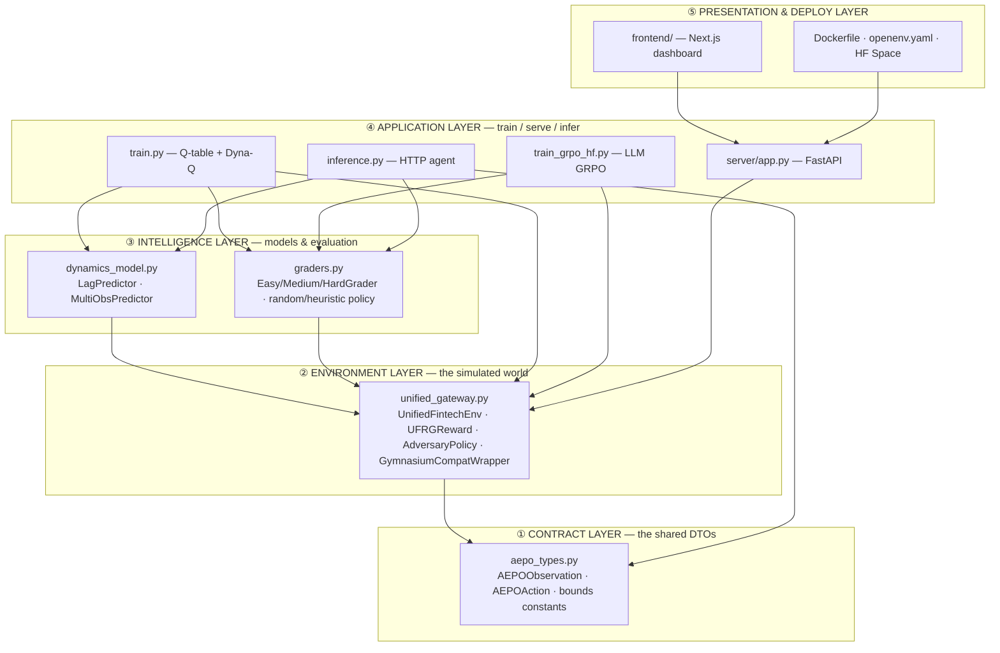
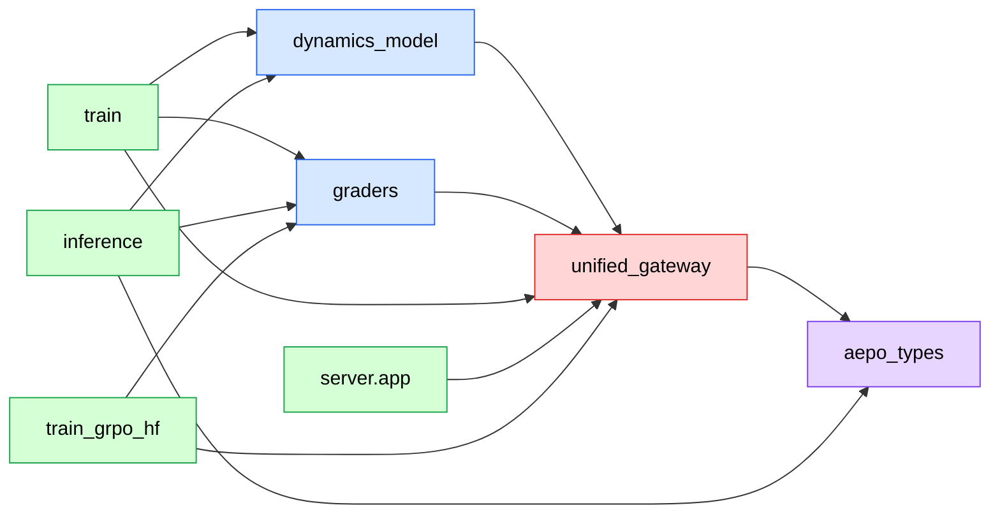
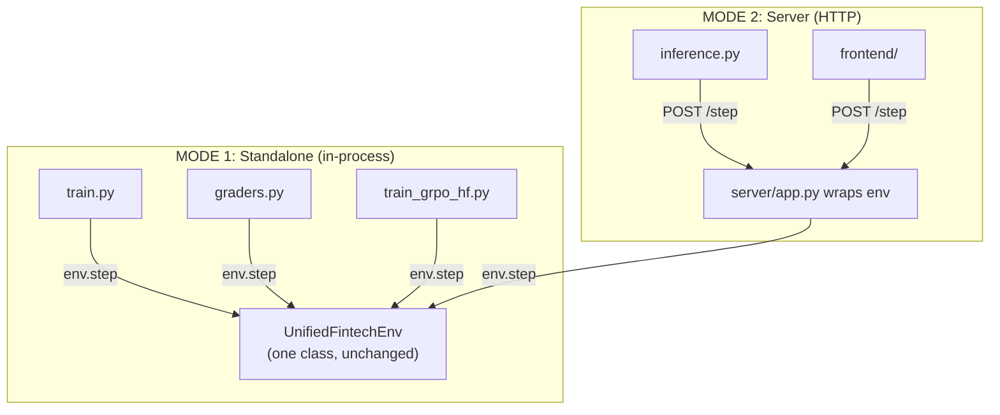
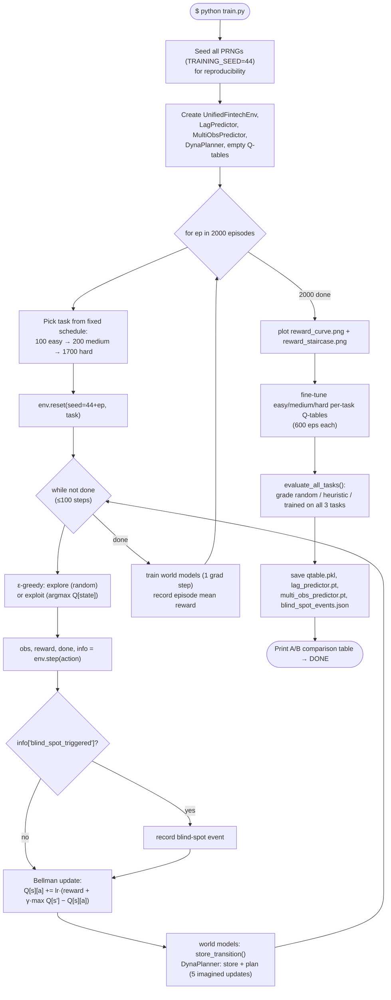
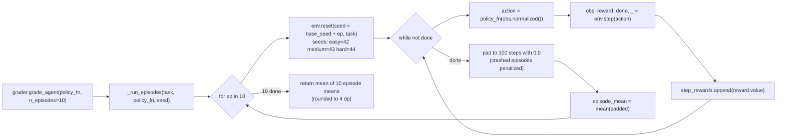

# 04 — Project Architecture

> **Goal:** See how every component fits together, trace the complete execution flow from "user starts the project" to "agent produces an action," and understand the key architectural decisions (dual-mode, shared contract, 4-tuple) and *why* they were made.

## Table of Contents

1. [The layered architecture](#1-the-layered-architecture)
2. [Component responsibilities (who does what)](#2-component-responsibilities)
3. [The dependency graph (who imports whom)](#3-the-dependency-graph)
4. [The dual-mode architecture (the keystone decision)](#4-the-dual-mode-architecture)
5. [Execution flow A — Training (`python train.py`)](#5-execution-flow-a--training)
6. [Execution flow B — Serving + Inference (the live demo)](#6-execution-flow-b--serving--inference)
7. [Execution flow C — Grading (how a score is produced)](#7-execution-flow-c--grading)
8. [The data contracts that hold it together](#8-the-data-contracts-that-hold-it-together)
9. [Architectural decisions & trade-offs](#9-architectural-decisions--trade-offs)
10. [Key takeaways](#10-key-takeaways)

---

## 1. The layered architecture

AEPO is best understood as **five layers**, bottom to top. Each layer only depends on the ones below it.



The thing to notice: **`aepo_types.py` is the foundation everything rests on**, and **`unified_gateway.py` is the load-bearing wall**. Almost every other file exists to *train against*, *evaluate*, *serve*, or *consume* the environment. If you understand those two files, you understand 70% of the project.

☕ **Java analogy:** Layer ① is a `common-dto` module. Layer ② is your core domain service. Layer ③ is supporting services (a predictor + a scorer). Layer ④ is the runnable apps (a batch job, a web service, a client). Layer ⑤ is the UI and deployment descriptors. Classic clean layering — dependencies point *downward only*.

---

## 2. Component responsibilities

A one-line job description for every component. (Doc 05 reads each in detail; Doc 06 covers every folder.)

| Component | One-line responsibility | Java analogy |
|-----------|-------------------------|--------------|
| `aepo_types.py` | Defines the typed, validated DTOs (`AEPOObservation`, `AEPOAction`) and bound constants — the single shared contract | `common-dto` module with validated `record`s |
| `unified_gateway.py` | **The environment.** Simulates the gateway: 10-obs, 6-action, 11 causal rules, 4-phase machine, reward function, adversary, world-model wrapper | the core stateful domain `@Service` |
| `dynamics_model.py` | Two neural-net **world models** that predict future state | a trainable predictor component |
| `graders.py` | Scores any policy on each task (deterministic, fixed seeds); ships baseline policies | a benchmarking/test-harness service |
| `train.py` | Trains the **Q-table** agent + world models on CPU, saves artifacts, plots curves | a batch job that builds an artifact |
| `train_grpo_hf.py` | Fine-tunes an **LLM** agent with GRPO on GPU | a heavyweight ML batch job |
| `server/app.py` | Wraps the env as a **REST API** (`/reset`, `/step`, `/state`) | a Spring `@RestController` |
| `inference.py` | The **agent client**: drives the env via HTTP, prints OpenEnv logs, grades results | a `WebClient`-based integration client |
| `frontend/` | Live **dashboard** visualizing the running env | a React SPA |
| `openenv.yaml` / `Dockerfile` | **Deployment** manifest & container | `manifest.yml` + `Dockerfile` |
| `tests/` | 221 tests, 97% coverage on the env | JUnit suite |
| `java-mirror/` | A Java translation of every Python file — *your* reading aid | the same logic in your native language |
| `results/` | Saved artifacts: Q-table, weights, charts, event logs | `target/` build outputs |

---

## 3. The dependency graph

Concretely, who `import`s whom (verified from the actual `import` statements). Arrows mean "depends on / imports from."



Two design rules are visible here and both are intentional:

1. **`inference.py` imports `aepo_types`, NOT `unified_gateway`.** The client never touches the environment class directly — it only knows the *DTOs* and talks to the *server over HTTP*. This is the **OpenEnv client/server separation rule**: the grader's client and your server must be decoupled, communicating only via the API. (`inference.py` *does* import `dynamics_model` and `graders`, but only to load saved weights and to score trajectories locally — never the env itself.)

2. **Nothing imports "upward."** `aepo_types` depends on nothing in the project. `unified_gateway` depends only on `aepo_types`. No cycles. This is why the shared contract works cleanly.

☕ **Java analogy:** It's the textbook acyclic module graph Maven enforces. `common-dto` (aepo_types) at the bottom, `core-service` (unified_gateway) above it, then `client` (inference) depending only on `common-dto` + the HTTP API — never on `core-service` internals. Exactly how you'd structure a microservice + its SDK.

---

## 4. The dual-mode architecture

This is the **single most important design decision** in the project, and it's a likely interview question. CLAUDE.md calls it "NON-NEGOTIABLE."

**The rule:** `UnifiedFintechEnv` must work in **two modes with zero code changes**:

- **Standalone (in-process):** `train.py`, `graders.py`, and `train_grpo_hf.py` import the class and call `env.reset()` / `env.step()` *directly*, in the same Python process. Fast, no network.
- **Server (over HTTP):** `server/app.py` imports the *same class*, holds one instance, and exposes `env.reset()`/`env.step()` as REST endpoints. `inference.py` and the frontend hit it over HTTP.



**Why it matters:** the score the judges get from the *live HTTP Space* must be **identical** to the score from the *local standalone graders*. If serving used a different (or modified) env, the two would diverge and the submission's numbers would be untrustworthy. `tests/test_dual_mode.py` literally asserts "server and standalone produce identical reward for identical seed and actions."

**How it's achieved:** the env is a plain class with no knowledge of HTTP. The server is a *thin wrapper* — it imports the class, keeps a module-level singleton, serializes the typed DTOs with `.model_dump()`, and adds an `asyncio.Lock` for concurrency. The environment logic lives in exactly one place.

⚠️ **The trap this avoids:** if you ever found yourself writing `if running_as_server: ... else: ...` inside `unified_gateway.py`, you'd have broken dual-mode. CLAUDE.md's instruction: "If you ever write code that requires modification to unified_gateway.py to switch between modes, stop and redesign."

☕ **Java analogy:** You have a `@Service` with pure business logic and *no* web dependencies. A separate `@RestController` injects it and exposes `service.step()` as `POST /step`. Your batch jobs call the *same* `@Service` bean directly. The controller is a thin adapter; the service is mode-agnostic. Identical results guaranteed because it's literally the same bean. This is just **hexagonal architecture / ports-and-adapters**.

---

## 5. Execution flow A — Training

What happens when you run `python train.py`. This produces the trained agent and all the artifacts.



**The narrative:** seed everything → build the env and models → loop 2000 episodes (each episode = reset + up to 100 steps) → on each step act ε-greedily, take a real step, do a Bellman update, store transitions, and run 5 *imagined* Dyna-Q updates → at episode end, take one gradient step on each world model → after all episodes, draw charts, fine-tune the per-task tables, evaluate, and save artifacts. Total: under 20 minutes on 2 vCPU. (Doc 08 dissects this file.)

---

## 6. Execution flow B — Serving + Inference

This is **the live demo** the judges see: the server runs the env; `inference.py` (or an LLM, or the frontend) drives it.

```mermaid
sequenceDiagram
    autonumber
    actor U as You / Judge / Grader
    participant INF as inference.py (client)
    participant APP as server/app.py (FastAPI)
    participant ENV as UnifiedFintechEnv
    participant Q as results/qtable.pkl + lag_predictor.pt

    Note over APP,ENV: At server startup: env = UnifiedFintechEnv(); env.reset(easy)
    U->>INF: run inference.py (AGENT_MODE=qtable/llm/heuristic)
    INF->>Q: load Q-table & LagPredictor weights
    loop for task in [easy, medium, hard]
        INF->>APP: POST /reset {"task": task}
        APP->>ENV: env.reset(options={task})
        ENV-->>APP: obs, info
        APP-->>INF: {observation, info}
        loop while not done (≤100 steps)
            Note over INF: get_action(obs): Q-table lookup / LLM call / heuristic
            Note over INF: if kafka_lag high → LagPredictor infra override
            INF->>APP: POST /step {"action": {...}}
            APP->>ENV: env.step(action)  (under asyncio lock)
            ENV-->>APP: obs, typed_reward, done, info
            APP-->>INF: {observation, reward, done, info}
            INF->>U: print [STEP] step=N action={...} reward=X done=...
        end
        INF->>U: print [END] success=... score=... rewards=...
    end
```

**The narrative:** the server boots and primes one env instance. The client loads its trained artifacts, then for each task: `POST /reset` to start an episode, then loop `POST /step` — each step the client decides an action (Q-table lookup, LLM prompt, or heuristic), optionally overrides infra routing using the world model when lag is dangerous, sends it, and prints a strict `[STEP]` log line. After 100 steps it prints `[END]` with the score. (Doc 09 dissects this end-to-end.)

The key architectural point: **the client and server are fully decoupled over HTTP.** The client could be replaced by the judges' own grader hitting the same endpoints, and it would work identically — that's the whole point of the OpenEnv contract.

---

## 7. Execution flow C — Grading

How any policy gets turned into a single comparable number — the deterministic, in-process path used in `train.py`'s evaluation and the tests.



**Why fixed seeds (42/43/44)?** Determinism. The same policy on the same seed always yields the same score, so results are reproducible and judges can re-run them. **Why pad crashed episodes with 0.0?** Because the episode score is defined as the mean over *all 100 steps* — crashing at step 12 means 88 steps of 0.0, which heavily penalizes crashing. This is exactly why the "Conservative" policy that never throttles scores only ~0.08 (it crashes early on hard, then 0.0 for the rest).

☕ **Java analogy:** A parameterized JUnit benchmark with a fixed random seed, run 10 times, averaging a score. Deterministic, reproducible, comparable across candidates.

---

## 8. The data contracts that hold it together

Three contracts make the whole system compose. If you remember three things from this doc, make it these:

### Contract 1 — The observation/action DTOs (`aepo_types.py`)
Every component speaks `AEPOObservation` (10 fields) and `AEPOAction` (6 fields). Pydantic validates them at construction, so invalid data can't propagate. The agent always sees `.normalized()` (a `dict[str, float]`, all values 0–1); raw values live only in `info["raw_obs"]`.

### Contract 2 — The `step()` 4-tuple (the OpenEnv contract)
```python
obs, reward, done, info = env.step(action)
#   AEPOObservation, UFRGReward, bool, dict
```
**AEPO deliberately uses a 4-tuple**, not the modern Gymnasium 5-tuple `(obs, reward, terminated, truncated, info)`. CLAUDE.md locks this: "4-tuple forever." Why? Because the OpenEnv spec, the graders, `inference.py`, and the HF Space all expect 4 fields — switching to 5 would break all of them simultaneously. The 5-tuple form exists *only* inside `GymnasiumCompatWrapper`, used solely to pass Gymnasium's `check_env` CI validation. (`reset()` returns a 2-tuple `(obs, info)`.)

⚠️ **This is a classic interview trap.** Gymnasium ≥0.26 standard is the 5-tuple. AEPO uses 4. Be ready to explain: "OpenEnv submission contract mandates the 4-tuple; we bridge to Gymnasium's 5-tuple only via a thin wrapper for `check_env`. AEPO never *truncates* — episodes end by crash, fraud, or the 100-step limit — so `truncated` would always be `False` anyway."

### Contract 3 — The `info` dict (the telemetry contract)
Every `step()` returns a richly-specified `info` dict: `phase`, `curriculum_level`, `step_in_episode`, `raw_obs`, `reward_breakdown`, `termination_reason`, `blind_spot_triggered`, and ~20 more keys. `inference.py` *validates* that the server returned every required key (`_REQUIRED_INFO_KEYS`) and raises if any is missing — so a server serialization bug is caught immediately, not silently scored as 0.

☕ **Java analogy:** Three API contracts: the request/response DTOs (validated `record`s), the method signature/return type (the 4-tuple = a fixed `record StepResult`), and a documented metadata envelope. Versioning discipline on all three keeps producer and consumer in lockstep.

---

## 9. Architectural decisions & trade-offs

The decisions a reviewer will probe, with the reasoning:

| Decision | Why | Trade-off accepted |
|----------|-----|--------------------|
| **Dual-mode (one env class, two modes)** | Guarantees HTTP score == local score; no divergence | Server must be a thin wrapper (can't bake serving logic into the env) |
| **Shared `aepo_types` module** | Client/server decoupling per OpenEnv; single source of truth for DTOs | One more module to maintain |
| **4-tuple, not 5-tuple** | OpenEnv contract; avoid breaking graders/server/inference at once | Must wrap for Gymnasium `check_env` compatibility |
| **Tabular Q-learning as the primary agent** | Runs on CPU in <20 min, fully reproducible, explainable, no GPU | Can't handle continuous state without discretization (16,384 bins) |
| **Discretize 7 features × 4 bins** | Keep state space reachable in 2000 episodes | Loses fine-grained distinctions within a bin |
| **Per-task Q-tables (not one global)** | Prevents catastrophic forgetting (hard updates overwriting easy values) | More memory; must pick the right table at eval time |
| **World model = small MLP** | Cheap, CPU-friendly, enough to predict lag (MSE ~0.007) | Not a high-capacity model; only as good as its training data |
| **Adversary as a tiny Q-table** | Makes "self-improvement"/"two learners" technically real, not just claimed | Adds cross-episode state that must be carefully reset per the contract |
| **FastAPI + module-level singleton env** | Curriculum level & adversary Q-table must persist across episodes | Needs an `asyncio.Lock` to serialize concurrent requests |
| **POMDP (noise + masking)** | Forces robust policies; justifies the world model's denoising role | Harder to learn; lower achievable ceiling |

💡 **Interview tip:** For any "why did you build it this way?" question, name the decision, the benefit, *and the trade-off you accepted*. Acknowledging the downside is what separates a senior answer from a junior one. E.g.: "Tabular Q-learning — chosen for CPU-feasibility, reproducibility, and explainability, accepting that it needs state discretization, which loses resolution; we mitigated that by hand-picking the 7 causal features."

---

## 10. Key takeaways

- AEPO is **five clean layers**: contract → environment → intelligence → application → presentation/deploy, with dependencies pointing only downward.
- **`aepo_types.py` (contract) and `unified_gateway.py` (environment)** are the two files that carry the project; everything else trains, evaluates, serves, or consumes them.
- The **dual-mode architecture** (one env class, used in-process *and* behind HTTP, unchanged) guarantees the live Space's score equals the local graders' score — verified by `test_dual_mode.py`.
- Three execution flows: **training** (`train.py` builds the agent + artifacts), **serving+inference** (the live demo over HTTP), and **grading** (deterministic, fixed-seed scoring).
- Three contracts bind it: the **DTOs**, the **`step()` 4-tuple** (OpenEnv, not Gymnasium 5-tuple — a known interview trap), and the **`info` telemetry dict**.
- Every architectural choice trades something; be ready to state the benefit *and* the cost.

### Summary

You can now draw the system from memory and trace any request from entry point to the agent's action. The skeleton is clear. Next we put meat on it: Doc 05 reads every core source file line by line, so you understand not just *what* connects to what, but exactly *how* each file does its job.

➡️ Next: [05_Source_Code_Walkthrough.md](05_Source_Code_Walkthrough.md)
