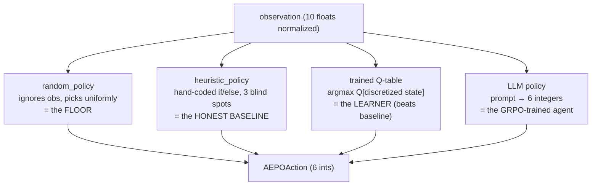

# 07 — How AEPO Uses Reinforcement Learning

> **Goal:** Map the abstract RL vocabulary from Doc 03 onto *this specific project*. Precisely: what is the environment, agent, observation, action, reward, and state in AEPO? What is being optimized, under what constraints, and why was it designed this way? This is the document that makes you fluent in "AEPO as an RL problem."

## Table of Contents

1. [The RL mapping table](#1-the-rl-mapping-table)
2. [The environment, precisely](#2-the-environment-precisely)
3. [The observation space — all 10 signals](#3-the-observation-space--all-10-signals)
4. [The action space — all 6 decisions](#4-the-action-space--all-6-decisions)
5. [The reward function — the complete specification](#5-the-reward-function--the-complete-specification)
6. [The state — internal accumulators & POMDP](#6-the-state--internal-accumulators--pomdp)
7. [The 11 causal transitions (what makes it RL-worthy)](#7-the-11-causal-transitions)
8. [What is being optimized?](#8-what-is-being-optimized)
9. [The constraints](#9-the-constraints)
10. [The agents (the policies that act)](#10-the-agents-the-policies-that-act)
11. [Why this design? (anti-reward-hacking & blind spots)](#11-why-this-design)
12. [The info dict — the full telemetry contract](#12-the-info-dict--the-full-telemetry-contract)
13. [Key takeaways](#13-key-takeaways)

---

## 1. The RL mapping table

Every abstract RL term, instantiated for AEPO:

| RL concept | In AEPO | Where in code |
|------------|---------|---------------|
| **Environment** | `UnifiedFintechEnv` — the simulated UPI gateway | `unified_gateway.py` |
| **Agent / Policy** | A function `obs → action`: random, heuristic, trained Q-table, or LLM | `graders.py`, `train.py`, `inference.py` |
| **State** | The env's full internal situation (accumulators, queues, hidden clock, true tier) | private `_` fields in `UnifiedFintechEnv` |
| **Observation** | The 10-number, noisy, partially-masked slice the agent sees | `AEPOObservation.normalized()` |
| **Action** | 6 integers (risk/crypto/infra/db/settlement/priority) | `AEPOAction` |
| **Reward** | A float in [0,1]: `base 0.8 ± bonuses/penalties` | `step()` reward section |
| **Step** | One `env.step(action)` call (≈ one transaction tick) | `step()` |
| **Episode** | 100 steps (or early crash/fraud) = one full gateway "shift" | the `while not done` loop |
| **Return / objective** | Mean reward over the 100 steps (crashes padded with 0.0) | `_run_episodes`, `_close_episode` |
| **Discount γ** | 0.95 (used in training's Bellman update) | `train.py` `DISCOUNT` |
| **World model** | `LagPredictor` / `MultiObsPredictor` — predict the next state | `dynamics_model.py` |
| **Adversary** | A second Q-learner that escalates difficulty | `AdversaryPolicy` |
| **Episode-score definition** | mean of all 100 step-rewards, 0.0-padded for early exits | spec |

This table is the Rosetta Stone — keep it handy as you read everything else.

---

## 2. The environment, precisely

`UnifiedFintechEnv` is a **Markov Decision Process (MDP)** — actually a **POMDP** (Partially Observable MDP) because the agent can't see the full state. Formally an MDP is the tuple *(States, Actions, Transition dynamics, Reward, Discount)*:

- **States (S):** the env's internal situation — kafka lag, latency, P99 EMA, DB pool, bank status, entropy, the throttle-relief queue, the settlement backlog, the circuit-breaker counter, the hidden diurnal clock, the true merchant tier, and the cross-episode curriculum/adversary state.
- **Actions (A):** the 216 combinations of the 6-field action.
- **Transition dynamics (T):** the **11 causal transitions** + the phase machine — how the state evolves given an action. This is the "physics."
- **Reward (R):** the [0,1] scoring function.
- **Discount (γ):** 0.95 (the agent's planning horizon).

☕ **Java analogy:** the env is a deterministic-given-seed **state machine** with one transition method, `step(action)`. The "MDP" framing just says: the next state depends only on the *current* state and the action (the **Markov property**), not on the entire history. AEPO honors this — all history is *compressed into* the accumulators (lag, backlog, streaks), so the current state is a sufficient statistic.

💡 **Interview tip:** "Is your environment an MDP or a POMDP?" → "A POMDP. The agent observes a noisy, partially-masked 10-dim projection of a richer internal state — we add Gaussian noise to lag/latency, hide merchant_tier 30% of steps, and never expose the diurnal clock. This forces robust policies and gives the world model a denoising role."

---

## 3. The observation space — all 10 signals

The agent sees a `Box(10,)` — 10 floats. Stored raw (with Pydantic bounds), exposed `.normalized()` to [0,1]. Organized in three layers (Risk / Infra / Business):

| # | Layer | Field (raw → agent name) | Raw range | Norm | Causal role / what it tells the agent |
|---|-------|--------------------------|-----------|------|----------------------------------------|
| 0 | Risk | `channel` → `transaction_type` | {0,1,2} | ÷2 | Payment channel: P2P / P2M / AutoPay |
| 1 | Risk | `risk_score` | [0,100] | ÷100 | Primary fraud signal; **>80 = HIGH RISK** |
| 2 | Risk | `adversary_threat_level` | [0,10] | ÷10 | Adversary pressure; escalates as the agent improves |
| 3 | Risk | `system_entropy` | [0,100] | ÷100 | System chaos; **>70 → random +100–300ms latency spike** |
| 4 | Infra | `kafka_lag` | [0,10000] | ÷10000 | Consumer backlog; **>4000 (2 steps) = CRASH** |
| 5 | Infra | `api_latency` | [0,5000] | ÷5000 | Bank API latency; driven by lag + bank + entropy |
| 6 | Infra | `rolling_p99` | [0,5000] | ÷5000 | EMA-smoothed P99; **>800 = SLA breach (−0.30)** |
| 7 | Infra | `db_connection_pool` | [0,100] | ÷100 | Pool utilization; >80 + Backoff → +100ms; <20 + Backoff → penalty |
| 8 | Business | `bank_api_status` | {0,1,2} | 0/0.5/1 | Healthy/Degraded/Unknown; Degraded + StandardSync → P99 +200 |
| 9 | Business | `merchant_tier` | {0,1} | 0/1 | Small/Enterprise; sets the optimal `app_priority` (masked 30% of steps) |

**Why these 10?** They're the minimal set that spans the three competing concerns (fraud, infra, SLA) and *causally drive* the reward. Notice every observed field connects to at least one reward term or transition — there's no decorative signal.

⚠️ **Two naming subtleties** (both interview-worthy):
- `channel` is the stored/DB name; the agent sees it as `transaction_type`. Same scalar, two names.
- `rolling_p99` in the obs is an **EMA** (smooth training signal); the *true* sliding-window P99 is computed separately and exposed only in `info["true_p99"]` — it's not the reward signal. This separation keeps the agent's training signal smooth while still reporting the "real" percentile for humans.

---

## 4. The action space — all 6 decisions

The agent outputs a `MultiDiscrete([3,2,3,2,2,3])` — 6 independent discrete choices, 216 combinations. **Every action field has a failure mode** (no free actions):

| # | Layer | Field | Choices | Failure condition |
|---|-------|-------|---------|-------------------|
| 0 | Risk | `risk_decision` | 0=Approve · 1=Reject · 2=Challenge | Approve + SkipVerify + risk>80 → **fraud catastrophe** (reward 0, done) |
| 1 | Risk | `crypto_verify` | 0=FullVerify · 1=SkipVerify | (see above; also FullVerify costs +150 lag/step) |
| 2 | Infra | `infra_routing` | 0=Normal · 1=Throttle · 2=CircuitBreaker | CircuitBreaker → −0.50/step (open state) |
| 3 | Infra | `db_retry_policy` | 0=FailFast · 1=ExponentialBackoff | Backoff when pool<20 → −0.10 |
| 4 | Business | `settlement_policy` | 0=StandardSync · 1=DeferredAsyncFallback | DeferredAsync in normal phase → −0.15; 5+ consecutive → −0.20 |
| 5 | Business | `app_priority` | 0=UPI · 1=Credit · 2=Balanced | Mismatch to merchant_tier → missed +0.02 bonus |

The agent must pick *all six every step*. The genius (and difficulty) is that the optimal choice for each field depends on the current observation *and* the delayed consequences. ☕ It's like a 6-field form the agent submits each tick, where every field has a "wrong answer" penalty and the right answer shifts with the situation.

---

## 5. The reward function — the complete specification

This is the rubric the agent is graded on every step (read the code in Doc 05 §9; here's the full spec as a reference). Start at **`base = 0.8`**, apply everything, **clamp to [0,1]**; crash/fraud override to **0.0**.

### Primary overrides (these win over everything)
| Condition | Effect |
|-----------|--------|
| Approve + SkipVerify + risk_score > 80 | reward = 0.0, done = True (**fraud**) |
| kafka_lag > 4000 for 2 consecutive steps | reward = 0.0, done = True (**crash**) |
| rolling_p99 > 800 | −0.30 (SLA breach) |

### Secondary shaping (bonuses + and penalties −)
| Condition | Effect | Meaning |
|-----------|:------:|---------|
| Challenge on risk>80 | +0.05 | correct: PIN reprompt before reject |
| FullVerify on risk>80 | +0.03 | correct crypto gate |
| **Reject + SkipVerify on risk>80** | **+0.04** | **blind spot #1** — equally safe, 250 lag cheaper |
| Throttle during Spike | −0.10 | proactive, acceptable cost |
| Throttle during Normal | −0.20 | drops legit traffic — wasteful |
| CircuitBreaker (open) | −0.50 | nuclear option |
| CircuitBreaker → half-open close (lag<2000) | +0.05 | successful recovery |
| DeferredAsync when bank=Degraded | +0.04 | correct fallback |
| DeferredAsync during Normal | −0.15 | unnecessary overhead |
| DeferredAsync 5+ consecutive (backlog>10) | −0.20 | settlement debt |
| ExponentialBackoff when pool>80 | +0.03 | correct retry under pressure |
| ExponentialBackoff when pool<20 | −0.10 | wasteful — blind spot #3 |
| app_priority=UPI & tier=Small | +0.02 | blind spot #2 (tier match) |
| app_priority=Credit & tier=Enterprise | +0.02 | blind spot #2 (tier match) |
| 500 < rolling_p99 ≤ 800 | 0 to −0.10 linear | SLA early-warning gradient |
| 3000 < kafka_lag ≤ 4000 | 0 to −0.10 linear | pre-crash gradient |
| Reject 6+ consecutive | −0.15 | anti-reject-spam |
| Approve + risk<40 + lag<1200 | +0.03 | throughput bonus (oppose reject-spam) |

### The composition
```
raw  = 0.8 + fraud_penalty + sla_penalty + infra_penalty + db_penalty + settlement_penalty + bonus
final = 0.0 if (crashed or fraud) else clamp(raw, 0.0, 1.0)
```

**Reading the design:** the reward *teaches* a nuanced operator. It rewards correct caution (Challenge/FullVerify on high risk), penalizes blunt tools (CircuitBreaker, over-throttling), and — crucially — *also rewards* the non-obvious optimum (Reject+SkipVerify), which is the discovery story. The proximity gradients (SLA, lag) give the agent a *smooth* signal as it approaches a cliff, instead of a sudden penalty — this is what makes the problem learnable.

💡 **Interview tip:** If asked "how do you prevent reward hacking?", name the pairing: every exploit (always-CB, always-reject, always-defer, always-backoff) has a *direct* penalty, AND there's a *counter-incentive* (the throughput bonus opposes reject-spam; the backlog accumulator opposes always-defer). It's not just penalties — it's a balanced incentive structure.

---

## 6. The state — internal accumulators & POMDP

The full state is much richer than the 10 observed numbers. The hidden parts (interview gold — they show the env has *memory*):

**Per-episode hidden accumulators:**
- `_kafka_lag`, `_api_latency`, `_rolling_p99` — the clean internal values (the obs adds noise on top).
- `_throttle_relief_queue` — pending −150 lag reliefs from past throttle actions (delayed causality).
- `_lag_latency_carry` — last step's lag→latency contribution, applied next step.
- `_cumulative_settlement_backlog` — settlement "technical debt" that must be paid down.
- `_consecutive_rejects`, `_cb_consecutive_steps`, `_lag_critical_streak` — streak counters for anti-spam, the CB state machine, and the 2-step crash grace.
- `_latency_window` — a 20-sample ring buffer for the true P99.
- `_system_entropy`, `_db_pool`, `_bank_status` — driven by phase/lag.
- `_merchant_tier` (true value), `_tier_hidden` (whether it's masked this step).

**Cross-episode hidden state (survives reset):**
- `_curriculum_level` (0/1/2, never regresses), `_adversary_threat_level`, the adversary Q-table, the 5-episode reward windows.

**The hidden diurnal clock:** `sin(step·2π/100)·100` added to lag each step — never observed, must be inferred.

This is what makes it a **POMDP** and what makes it *not memoryless*. A purely reactive policy that maps the 10 observed numbers to an action — ignoring that the env *remembers* throttle relief, settlement debt, and the hidden clock — will underperform a policy that learns to anticipate these.

☕ **Java analogy:** the observed DTO is a thin, noisy view of a fat internal `SessionState` object full of queues, counters, EMAs, and a hidden timer. The client never sees the full `SessionState`; it must infer it from the noisy DTO stream. That inference gap is *the* reason a learned (and world-model-augmented) policy beats a reactive rulebook.

---

## 7. The 11 causal transitions

These are the env's "physics" — the rules that make decisions *echo across time*. Without them, AEPO would be a memoryless lookup and RL would be pointless. (Read the code in Doc 05 §8–9; here's the catalog.)

| # | Transition | Rule | Why it matters |
|---|-----------|------|----------------|
| 1 | **Lag → Latency** | `api_latency[t+1] += 0.1·max(0, kafka_lag[t] − 3000)` | High lag *poisons next step's* latency |
| 2 | **Throttle Relief** | Throttle → schedules −150 lag over the **next 2 steps** | Relief is *delayed* — must act before the cliff |
| 3 | **Bank Coupling** | Degraded + StandardSync → P99 += 200 (this step) | Wrong settlement choice spikes SLA |
| 4 | **DB Pressure** | pool>80 + Backoff → latency += 100 | Retry under load adds latency |
| 5 | **DB Waste** | pool<20 + Backoff → −0.10 reward | Retrying with spare capacity is wasteful |
| 6 | **Entropy Spike** | entropy>70 → latency += uniform(100,300) | Chaos injects random latency |
| 7 | **Adversary Escalation** | 5-ep avg>0.6 → threat += 0.5 (5-episode **lag**) | The staircase: improve → harder |
| 8 | **P99 EMA** | `p99[t] = 0.8·p99[t−1] + 0.2·latency[t]` (α=0.5 in Recovery) | Smooth, memory-carrying SLA signal |
| 9 | **Entropy driver** | entropy EMA tracks kafka_lag (2nd-order loop) | lag → entropy → latency spike feedback |
| 10 | **Bank Flapping** | Markov chain: Spike H→D 30%/D→H 40%; Attack H→D 80%/D→H 5% | Realistic sticky-vs-flappy bank behavior |
| 11 | **Diurnal Clock** | `lag_delta += 100·sin(step·2π/100)` | Hidden daily load cycle to hedge against |

The **5-episode lag** on #7 is the most important single design choice for the pitch: it's *why* the reward curve is a staircase instead of a flat line. The agent improves, but the environment only ratchets up difficulty 5 episodes later, so you see "climb → step up in difficulty → dip → climb again."

💡 **Interview tip:** "What makes your environment more than a lookup table?" → cite transitions #1, #2, #7: lag poisons *future* latency, throttle relief is *delayed two steps*, and the adversary escalates with a *5-episode lag*. These temporal dependencies are precisely what a memoryless simulator can't model and what RL is built to exploit.

---

## 8. What is being optimized?

**The objective:** maximize the **mean reward per step over a 100-step episode**, where a crashed/early-terminated episode pads its remaining steps with 0.0.

```
episode_score = mean([reward_1, reward_2, ..., reward_100])   # crashes → 0.0 padding
```

Across training, the agent maximizes this in *expectation* over the task's distribution (random phases, noise, adversary). The Q-table does it indirectly via the Bellman objective (maximize discounted return); the LLM does it directly via GRPO (maximize the env reward of its generated action).

**Why mean-per-step (not sum)?** It normalizes across episode lengths and makes the [0,1] interpretation clean: 0.8 = "competent baseline," 1.0 = "perfect," <0.3 = "failing/crashing." It also makes crashing *very* costly — crashing at step 12 means 88 steps of 0.0, dragging the mean to ~0.08 (this is exactly why the never-throttle "Conservative" policy scores ~0.08 on hard).

☕ **Java analogy:** the objective function is `avg(score per request) over a 100-request session`. Crashing early = the session aborts and the remaining requests score 0 — so reliability is baked into the metric, not bolted on.

---

## 9. The constraints

The hard rules the environment and submission enforce:

| Constraint | Value | Why |
|------------|-------|-----|
| Episode length | exactly 100 steps | fixed horizon for comparable scoring |
| Reward bounds | [0.0, 1.0] always | OpenEnv contract; clean interpretation |
| Early termination | crash (lag>4000×2 steps) or fraud (Approve+Skip+risk>80) | the two unrecoverable failures |
| No recovery within an episode | crash/fraud ends it; padding with 0.0 | failures are permanent that shift |
| `step()` return | 4-tuple `(obs, reward, done, info)` | OpenEnv (not Gymnasium 5-tuple) |
| Phase sequence | fixed at reset, never mixed | reproducibility; the curriculum picks the *task*, not the phases |
| Determinism | fixed seeds (easy=42, medium=43, hard=44) | reproducible grading |
| Compute budget | train < 20 min on 2 vCPU / 8 GB, CPU-only | deployment efficiency theme |
| Action validity | Pydantic rejects out-of-range at construction | env never sees invalid input |

These constraints are *features*: the fixed horizon + crash padding makes the metric honest; the [0,1] bound + determinism makes scores comparable and reproducible; the CPU budget keeps it deployable.

---

## 10. The agents (the policies that act)

AEPO ships **four** policies — the same environment, different `obs → action` functions. The whole project is a comparison among them.



- **`random_policy`** — proves the task isn't trivially solvable (random scores ~0.25 on hard).
- **`heuristic_policy`** — the *fair* baseline: a competent senior-SRE rulebook with exactly 3 deliberate blind spots. Passes easy, avoids crashes, scores ~0.30 on hard.
- **Trained Q-table** — learned via `train.py`; scores 0.6650 on hard (2.25× the heuristic). Found all 3 blind spots.
- **LLM policy** — a Qwen model, optionally GRPO-fine-tuned, prompted to output 6 integers; used in `inference.py`'s default `llm` mode.

🎤 **Pitch framing:** call it "**baseline policy vs learned policy improvement curve**," never "random vs heuristic comparison" — the latter sounds like a toy benchmark; the former is the story of an agent *learning to beat the expert*.

---

## 11. Why this design?

Three design pillars, each defensible under scrutiny:

### Pillar 1 — Anti-reward-hacking ("no free actions")
RL agents are notorious for finding degenerate shortcuts. AEPO pre-empts every obvious one:
| Exploit an agent might find | Defense |
|------------------------------|---------|
| Always CircuitBreaker (dodge lag) | −0.50/step → guaranteed ~0.30 score; CB drains slowly, no "magic erase" |
| Always Reject (dodge fraud) | −0.15 after 6 consecutive + a throughput bonus for approving clean traffic |
| Always DeferredAsync (dodge bank coupling) | −0.15 in normal + a backlog accumulator (−0.20 after 5) |
| Always Backoff (dodge DB) | −0.10 when pool<20 |
| Alternate async/sync to dodge the consecutive penalty | a *physical accumulator* (`_cumulative_settlement_backlog`) that you must pay down |
This is what separates a serious environment from a toy: the reward surface has no cheap exploit.

### Pillar 2 — The 3 blind spots (the learning story)
The heuristic is *deliberately* incomplete in 3 ways the trained agent must discover:
1. **Reject + SkipVerify on high risk** (+0.04, saves 250 lag) — heuristic uses FullVerify.
2. **Match app_priority to merchant_tier** (+0.02) — heuristic always Balanced.
3. **FailFast when pool<20** (avoids −0.10) — heuristic always Backoff.
These exist so the trained agent's advantage is *attributable to specific learned behaviors*, not noise. `blind_spot_triggered` in `info` proves the heuristic never fires #1 (by design) while the trained agent does.

### Pillar 3 — The POMDP + adversary (robustness + self-improvement)
Noise, masking, the hidden clock (POMDP) force *robust* policies and justify the world model's denoising role. The adversary Q-table makes "the environment gets harder" a *real, learned* mechanism (Theme #4), producing the staircase.

☕ **Java analogy:** This is exactly how you'd design a *fair* benchmark for a self-tuning system: plug every cheap shortcut (so it can't game the metric), seed specific known-good optimizations it must rediscover (so wins are explainable), and add controlled noise + an adaptive load generator (so it proves robustness, not overfitting).

---

## 12. The info dict — the full telemetry contract

Every `step()` returns this `info` dict (a `Map<String,Object>`). It carries *everything humans/graders/dashboards need*, separate from the agent's decision input. The full contract:

```python
info = {
    "phase": "normal"|"spike"|"attack"|"recovery",
    "curriculum_level": 0|1|2,
    "step_in_episode": int,                 # 1..100
    "raw_obs": { ...all 10 un-normalized raw values... },
    "true_p99": float,                      # real sliding-window P99 (not the EMA)
    "reward_breakdown": { base, fraud_penalty, sla_penalty, infra_penalty,
                          db_penalty, settlement_penalty, bonus, final },
    "termination_reason": None|"crash"|"fraud",
    "adversary_threat_level_raw": float,
    "blind_spot_triggered": bool,           # True on Reject+SkipVerify+high-risk
    "consecutive_deferred_async": int,      # settlement backlog counter
    "tier_hidden": bool,                    # was merchant_tier masked this step?
    "cb_consecutive_steps": int,            # circuit-breaker FSM state
    "consecutive_rejects": int,
    "reject_spam_active": bool,
    "throughput_bonus_active": bool,
    "p99_ema_alpha": float, "p99_poisoning_fix_active": bool,
    "lag_critical_streak": int, "crash_grace_active": bool,
    "diurnal_pressure": float, "diurnal_lag_contribution": float, "diurnal_pomdp_hidden": True,
    # + backward-compat keys for the trajectory grader:
    "step", "task", "event_type", "obs_risk_score", "obs_kafka_lag", "obs_rolling_p99",
    "action_risk_decision", "action_infra_routing", "action_crypto_verify",
    "reward_raw", "reward_final", "circuit_breaker_tripped", "crashed", "done", ...
}
```

`inference.py` **validates** that the server returned every key in `_REQUIRED_INFO_KEYS` and raises if any is missing — so a serialization bug surfaces immediately instead of silently scoring 0. The dict is also the dashboard's data source and the blind-spot logger's input.

☕ **Java analogy:** a fat observability/diagnostics envelope returned alongside the business payload — like a response with the result *plus* a debug/trace map. The agent ignores it; everything *around* the agent (logging, grading, UI, audits) depends on it.

---

## 13. Key takeaways

- **AEPO is a POMDP:** the agent sees a noisy, partially-masked 10-dim projection of a much richer internal state; this is deliberate (robustness + a job for the world model).
- The **10 observations** span Risk/Infra/Business and each causally drives the reward; the **6 actions** each have a failure mode (no free actions); the **reward** is `base 0.8 ± shaping`, clamped to [0,1], with fraud/crash overriding to 0.0.
- The **objective** is mean reward per step over 100 steps (crashes padded with 0.0) — which bakes reliability into the metric.
- The **11 causal transitions** (especially delayed throttle relief and the 5-episode-lagged adversary) make decisions echo across time — the reason RL beats a reactive rulebook and the source of the *staircase*.
- The design rests on three defensible pillars: **anti-reward-hacking** ("no free actions"), the **3 deliberate blind spots** (attributable learning), and the **POMDP + adversary** (robustness + self-improvement).
- The **`info` dict** is the telemetry contract — everything around the agent depends on it; `inference.py` validates its completeness.

### Summary

You now understand AEPO precisely as an RL problem: its MDP/POMDP structure, every observation and action, the complete reward rubric, the hidden state, the causal physics, the objective, the constraints, the four agents, and the design rationale. With the *what* fully nailed, the next two documents cover the *how of producing a good agent*: Doc 08 dissects the training pipeline (`train.py` + GRPO), and Doc 09 dissects inference (`inference.py` + server) end to end.

➡️ Next: [08_Training_Pipeline.md](08_Training_Pipeline.md)
