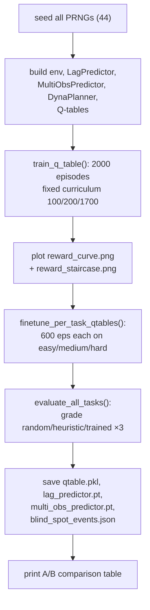
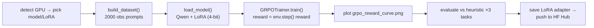

# 08 — The Training Pipeline

> **Goal:** Understand exactly how a *trained agent* is produced. We dissect `train.py` (the CPU Q-table + Dyna-Q + world-model trainer — the primary path) end to end, then `train_grpo_hf.py` (the GPU LLM fine-tuner). After this you can explain every step from `$ python train.py` to the saved `qtable.pkl`.

## Table of Contents

1. [Two training paths, one environment](#1-two-training-paths-one-environment)
2. [`train.py` — the big picture](#2-trainpy--the-big-picture)
3. [Reproducibility: seeding everything](#3-reproducibility-seeding-everything)
4. [State discretization & action encoding](#4-state-discretization--action-encoding)
5. [The fixed-schedule curriculum](#5-the-fixed-schedule-curriculum)
6. [The main training loop, step by step](#6-the-main-training-loop-step-by-step)
7. [Dyna-Q: planning with the world model](#7-dyna-q-planning-with-the-world-model)
8. [Per-task Q-tables & catastrophic forgetting](#8-per-task-q-tables--catastrophic-forgetting)
9. [Fine-tuning, evaluation & artifacts](#9-fine-tuning-evaluation--artifacts)
10. [The charts](#10-the-charts)
11. [`train_grpo_hf.py` — fine-tuning an LLM](#11-train_grpo_hfpy--fine-tuning-an-llm)
12. [Key takeaways](#12-key-takeaways)

---

## 1. Two training paths, one environment

AEPO can train two completely different kinds of agent against the *same* `UnifiedFintechEnv`:

| | `train.py` (primary) | `train_grpo_hf.py` (optional) |
|---|---|---|
| Agent type | a **Q-table** (lookup table of Q-values) | a **fine-tuned LLM** (Qwen 3B/7B) |
| Algorithm | Tabular Q-learning + Dyna-Q planning | GRPO (Group Relative Policy Optimization) |
| Hardware | **CPU**, 2 vCPU / 8 GB, < 20 min | **GPU** (T4 16GB or A10G 24GB) |
| Output | `qtable.pkl`, `lag_predictor.pt`, charts | a LoRA adapter pushed to HF Hub |
| Role | the proof-of-learning baseline that hits 0.6650 hard | the "LLM can learn it too" demonstration |

Both maximize the *same* environment reward, so their results are directly comparable. `train.py` is what produces the documented numbers and is what you run locally. Let's spend most of our time there.

---

## 2. `train.py` — the big picture



The whole script is: **train → chart → fine-tune → evaluate → save → report.** `main()` orchestrates it (with `--compare` for a rich table and `--compare-dyna` for the world-model-speedup chart). Everything hinges on `train_q_table()`.

☕ **Java analogy:** a batch job's `main()` that runs a training stage, writes report artifacts, runs an evaluation stage, and persists the model — exactly the shape of an ML training pipeline you'd schedule nightly.

---

## 3. Reproducibility: seeding everything

```python
TRAINING_SEED: int = 44   # matches the hard-task grader seed
random.seed(TRAINING_SEED)        # Python's RNG
np.random.seed(TRAINING_SEED)     # NumPy's RNG
torch.manual_seed(TRAINING_SEED)  # PyTorch's RNG
```
RL is full of randomness (ε-greedy choices, env noise, mini-batch sampling). Seeding *all three* RNG sources at import makes every run **bit-identical**. This is why the docs can claim "blind spot #1 first occurs at episode 335, step 41" — re-run training and you get the *same* episode/step, verifiable against `blind_spot_events.json`.

☕ **Java analogy:** passing a fixed `new Random(44)` everywhere so a stochastic process is reproducible — essential for a benchmark whose numbers you publish.

💡 **Interview tip:** "How do you make RL results reproducible?" → "Seed every PRNG (Python `random`, NumPy, PyTorch) from one constant, use fixed grader seeds, and pad crashes deterministically. Then the staircase, the eval scores, and the blind-spot discovery episode are all reproducible — which is what makes the claims auditable."

---

## 4. State discretization & action encoding

The Q-table needs **discrete** states and a single **integer** per action. Two helper functions do this.

### `obs_to_state()` — continuous obs → discrete state tuple
```python
N_BINS = 4
STATE_FEATURE_KEYS = ("risk_score","kafka_lag","rolling_p99","db_connection_pool",
                      "bank_api_status","merchant_tier","adversary_threat_level")  # 7 features

def obs_to_state(obs_normalized) -> tuple[int, ...]:
    return tuple(min(int(obs_normalized[k] * N_BINS), N_BINS - 1) for k in STATE_FEATURE_KEYS)
```
Each of 7 chosen features (a [0,1] float) is bucketed into one of **4 bins** → a 7-tuple of small ints. State space = **4⁷ = 16,384** cells — reachable in 2000 episodes. ☕ Turning continuous sensor readings into a `record` of 7 enum-like bucket indices, usable as a `HashMap` key.

**Why only 7 of the 10 features?** Using all 10 with 8 bins → 8¹⁰ ≈ 1 billion states, far too sparse to learn in 2000 episodes. The 7 chosen are the *causal drivers* of the reward (risk → fraud, lag → crash, p99 → SLA, pool → DB, bank → settlement, tier → priority, **adversary_threat_level** → the key feature that separates an easy Normal-phase state from a hard Attack-phase state with the same lag/risk bins). This feature selection is a real engineering decision, not arbitrary.

### `encode_action()` / `decode_action()` — mixed-radix encoding
```python
_STRIDES = (72, 36, 12, 6, 3, 1)   # place values for [3,2,3,2,2,3]
def encode_action(action) -> int:
    return sum(f*s for f,s in zip((action.risk_decision, action.crypto_verify, ...), _STRIDES))
def decode_action(idx) -> AEPOAction:
    # reverse: idx // stride, then idx %= stride, field by field
```
The 6-field action becomes one integer in [0, 215] via **mixed-radix** (positional) encoding — like reading a multi-digit number where each "digit" has a different base (3, 2, 3, 2, 2, 3). So `Q[state]` is a 216-element array, and `argmax` over it picks the best action. ☕ Exactly how you'd pack 6 small enums into a single index to use as an array offset — base-N digit packing.

---

## 5. The fixed-schedule curriculum

```python
EPISODES_PER_LEVEL = (100, 200, 1700)   # easy, medium, hard — sums to 2000
CURRICULUM_TASKS = ("easy", "medium", "hard")
```
The trainer spends 100 episodes on easy, 200 on medium, 1700 on hard — a **deterministic** schedule. **Why fixed, not the env's adaptive curriculum?** The env *has* an adaptive curriculum (advance after 5 consecutive episodes above threshold), but it **stalls under adversary escalation**: when the agent does well, the adversary raises threat, the next episode's reward drops below the gate, and the 5-streak breaks — so it never advances reliably. A fixed schedule **guarantees coverage** on every task and produces the clean staircase.

At each level boundary, three things happen (the "curriculum advance" block):
1. **Knowledge transfer:** the new task's per-task Q-table is *seeded* from the **easy** table (so medium/hard inherit baseline-correct reflexes like "Challenge on high risk" rather than starting blank).
2. **ε restart:** exploration is reset to 1.0 and re-decayed over the new level's budget — otherwise hard would inherit ε≈0.05 from the end of medium and never explore.
3. A log line records the advance.

🎤 **Pitch framing:** "a fixed-schedule curriculum that guarantees task coverage and produces the staircase." 🔧 **Reality:** the env's *adaptive* curriculum exists but is bypassed for training because adversary escalation makes it stall; the fixed schedule is the robust choice. (Both are true — be ready to explain why the adaptive one stalls; it's a great "why did you change approach?" answer.)

⚠️ **Doc-vs-code note:** some comments say "200 easy / 300 medium / 1500 hard"; the *actual constant* is `(100, 200, 1700)`. Trust the code. (Minor internal inconsistency worth knowing if a judge greps the file.)

---

## 6. The main training loop, step by step

`train_q_table()` is the core. Here's the loop annotated:

```python
for ep in range(N_EPISODES):                         # 2000 episodes
    task_to_use = <pick from EPISODES_PER_LEVEL schedule>
    obs_obj, _ = env.reset(seed=44+ep, options={"task": task_to_use})
    obs_norm = obs_obj.normalized()
    state = obs_to_state(obs_norm)
    done = False
    while not done:                                  # up to 100 steps
        # ── ε-greedy action selection ──
        if random.random() < epsilon:
            action_idx = random.randint(0, 215)      # EXPLORE
        else:
            action_idx = int(np.argmax(q_table[state]))  # EXPLOIT
        action = decode_action(action_idx)

        lag_input = build_input_vector(obs_norm, action)   # for the world model
        next_obs_obj, typed_reward, done, info = env.step(action)
        reward = typed_reward.value

        # ── blind-spot #1 logging ──
        if info.get("blind_spot_triggered"):
            blind_spot_events.append({... episode, step, reward, raw_obs, breakdown ...})

        # ── Bellman update (real transition) ──
        next_obs_norm = next_obs_obj.normalized()
        next_state = obs_to_state(next_obs_norm)
        target = reward + DISCOUNT * np.max(q_table[next_state])
        q_table[state][action_idx] += LEARNING_RATE * (target - q_table[state][action_idx])

        # ── same update on the per-task table ──
        per_task_table = q_tables_per_task[task_to_use]
        per_task_target = reward + DISCOUNT * np.max(per_task_table[next_state])
        per_task_table[state][action_idx] += LEARNING_RATE * (per_task_target - per_task_table[state][action_idx])

        # ── world models: remember this transition ──
        lag_model.store_transition(lag_input, next_obs_norm["kafka_lag"])
        multi_obs_model.store_transition(lag_input, build_full_obs_target_vector(next_obs_norm))

        # ── Dyna-Q: plan with the world model ──
        if use_dyna:
            dyna_planner.store(obs_norm, action_idx, reward, next_obs_norm)
            total_planning_updates += dyna_planner.plan(q_table, lag_model)   # 5 imagined updates

        obs_norm = next_obs_norm; state = next_state

    # ── end of episode ──
    lag_model.train_step()          # one gradient step on the LagPredictor
    multi_obs_model.train_step()    # one gradient step on the MultiObsPredictor
    ep_mean = mean(padded step_rewards)
    epsilon = max(0.05, epsilon - epsilon_decay)   # decay exploration
```

Everything you learned in Doc 03 is here in one place:
- **ε-greedy** picks explore vs exploit; **ε decays** each episode (per-level restarts at boundaries).
- **The Bellman update** (`reward + γ·max Q[next]`, nudged by lr=0.1) fills in the Q-values — applied to *both* the shared table and the active task's per-task table.
- **The world models remember** every transition (`store_transition`) and **learn** once per episode (`train_step`).
- **Dyna-Q plans** 5 imagined updates per real step (next section).
- **Blind spots are logged** with full context for `blind_spot_events.json`.

☕ **Java analogy:** a nested loop — outer over "sessions," inner over "requests" — that on each request consults a `Map<State,double[]>` strategy, applies an exponentially-smoothed update toward a computed target, and also feeds a separate predictive model. The "training" is just this loop run 2000×.

---

## 7. Dyna-Q: planning with the world model

This is the **Theme 3.1 "world model is load-bearing"** mechanism in `train.py`. The `DynaPlanner` makes the `LagPredictor` an active contributor to learning.

```python
class DynaPlanner:
    def store(self, obs_norm, action_idx, reward, next_obs_norm):
        self._buffer.append((obs_norm, action_idx, reward, next_obs_norm))   # remember real transitions

    def plan(self, q_table, lag_model, n_steps=5):
        for _ in range(min(n_steps, len(self._buffer))):
            obs_norm, action_idx, reward, next_obs_norm = <random past transition>
            x = build_input_vector(obs_norm, decode_action(action_idx))
            predicted_lag = lag_model(x).item()                  # WORLD MODEL predicts next lag
            imagined_next = dict(next_obs_norm); imagined_next["kafka_lag"] = predicted_lag
            # Bellman update on the IMAGINED transition
            target = reward + DISCOUNT * np.max(q_table[obs_to_state(imagined_next)])
            q_table[obs_to_state(obs_norm)][action_idx] += LEARNING_RATE * (target - ...)
```

**What it does:** after each *real* step, it replays 5 *remembered* transitions, but replaces their `kafka_lag` with the **LagPredictor's prediction**, and does Bellman updates on these *imagined* transitions. So the Q-table learns from ~6× more signal per real environment step.

**Why it's the proof:** without Dyna-Q, the world model would be "trained but unused." With it, the model's predictions *directly shape* the policy. `plot_dyna_comparison()` (via `--compare-dyna`) trains the Q-table twice — with and without Dyna — and charts that Dyna crosses the hard threshold *faster*, titled "World Model Accelerates Learning." This is `results/dyna_comparison.png`.

☕ **Java analogy:** Dyna-Q is "practice in your head." Instead of only learning from real production traffic (expensive, limited), you replay past requests through a *fast learned mock* of the downstream system and learn from those simulated outcomes too — multiplying training signal without extra real calls. The `test_world_model_integration.py` test literally counts `lag_model.forward()` calls to prove this is happening.

💡 **Interview tip:** This is the answer to the #1 audit jab: *"You trained a world model — does anything use it?"* → "Yes, twice. In training, Dyna-Q runs 5 imagined Bellman updates per real step using the LagPredictor's predictions (proven to speed convergence in `dyna_comparison.png` and locked by a test that counts forward() calls). In inference, it overrides infra routing at the crash cliff."

---

## 8. Per-task Q-tables & catastrophic forgetting

A subtle but important design point. A naive trainer uses **one** Q-table for all tasks. The problem: **catastrophic forgetting** — once training spends 1700 episodes on hard, the hard-task Bellman updates *overwrite* the Q-values that were optimal for easy/medium states. The agent "forgets" easy.

AEPO's fix: **per-task Q-tables.**
```python
q_tables_per_task = { "easy": defaultdict(...), "medium": defaultdict(...), "hard": defaultdict(...) }
```
Each task accumulates Bellman updates **only from its own episodes**, so easy never loses its head-start when hard dominates. At evaluation, each task is scored with *its own* table. This is why the documented scores are honest (easy=0.76, medium=0.63, hard=0.6650) instead of an easy-forgotten mess.

☕ **Java analogy:** instead of one shared mutable cache that later workloads pollute, you keep a *partitioned* cache per workload, so each is evaluated against the data that's actually relevant to it. Classic "avoid cross-contamination of shared mutable state."

💡 **Interview tip:** "What's catastrophic forgetting and how did you handle it?" → "When sequential training on a new task overwrites a neural net's / Q-table's knowledge of an old task. We use per-task Q-tables that only accumulate their own task's updates, plus curriculum *seeding* (medium/hard initialized from easy), so each task is evaluated on uncontaminated values. The README documents the pre-fix scores (easy FAILED at 0.71) to show this mattered."

---

## 9. Fine-tuning, evaluation & artifacts

After the 2000-episode main loop:

**`finetune_per_task_qtables()`** runs 600 extra episodes *per task* with a moderate ε (0.70→0.05) to *densify* the per-task tables — the main schedule's early exploration (ε=1.0) leaves early-task Q-values noisy; targeted fine-tuning sharpens them.

**`evaluate_all_tasks()`** grades random / heuristic / trained on all 3 tasks (10 episodes each). It uses **per-task Q-confidence thresholds**: easy/medium fall back to the heuristic (∞ threshold — their sparse tables underperform the heuristic), while hard *trusts the Q-table* (threshold 0.0 — dense enough to beat heuristic 0.33 vs 0.25). `make_trained_policy()` implements this: "use the Q-table's argmax if the state is known and confident, else fall back to `heuristic_policy`."

**Artifacts saved** (to `results/`):
```python
torch.save(lag_model.state_dict(), "results/lag_predictor.pt")
torch.save(multi_obs_model.state_dict(), "results/multi_obs_predictor.pt")
pickle.dump({task: dict(tbl) for task, tbl in q_tables_per_task.items()}, "results/qtable.pkl")
json.dump({... blind_spot_events ...}, "results/blind_spot_events.json")
```
These are the "compiled outputs" inference loads. `qtable.pkl` is a pickled per-task dict; the `.pt` files are PyTorch weights; `blind_spot_events.json` is the auditable discovery log.

---

## 10. The charts

Three plotting functions (all use matplotlib in headless "Agg" mode — no display needed on a server):
- **`plot_reward_curve()`** → `reward_curve.png`: raw + 10-episode rolling-mean reward with threshold reference lines.
- **`plot_reward_staircase()`** → `reward_staircase.png`: the same curve with **phase-colored backgrounds** (green=easy, orange=medium, red=hard) — the visual proof of curriculum + adversarial escalation. *This is the pitch's hero chart.*
- **`plot_dyna_comparison()`** → `dyna_comparison.png` (via `--compare-dyna`): two training runs (with/without Dyna-Q) showing the world model crosses the threshold faster.

☕ **Java analogy:** report-generation steps in a batch job that write PNG dashboards to the artifact directory — your "build produces a coverage report" equivalent, but for learning curves.

---

## 11. `train_grpo_hf.py` — fine-tuning an LLM

The optional GPU path: instead of a Q-table, fine-tune a **Large Language Model** to output the 6-integer action. Run on a GPU Space; it pushes a trained adapter to Hugging Face Hub.

### The new concepts (briefly, with analogies)
- **LLM** — a large neural net (Qwen 2.5, 3B or 7B parameters) that takes text and produces text. Here: prompt = the observation as text; completion = "1 1 0 0 0 2" (the action). ☕ A very large, pre-trained text-function.
- **Fine-tuning** — continuing to train a pre-trained model on your task so it specializes. ☕ Taking a vendor's pre-built library and customizing its behavior for your domain.
- **LoRA (Low-Rank Adaptation)** — instead of retraining all billions of weights, train a tiny set of "adapter" weights (rank 16/32). Cheap, fast, small to ship. ☕ A lightweight plugin/patch over a huge base — you ship the patch, not the whole rebuilt library.
- **GRPO (Group Relative Policy Optimization)** — the RL algorithm: the model generates several candidate actions per prompt, each is *scored by the environment reward*, and the model is nudged toward the higher-scoring ones *relative to the group*. ☕ Generate N candidates, rank them by a scoring function, reinforce the winners.
- **Unsloth / TRL** — libraries that make LoRA + GRPO fast and memory-efficient. **vLLM/4-bit** — inference/memory optimizations. ☕ Performance-tuning frameworks.

### The structure (mirrors `train.py`'s shape)
```python
def env_reward_func(completions, prompts, seed_val, task_name, **kwargs) -> list[float]:
    # GRPO calls this with the model's generated actions. For each:
    action = _parse_action(content)              # parse "1 1 0 0 0 2" → AEPOAction
    if action is None: rewards.append(0.0); continue   # malformed → 0 (format pressure)
    env = UnifiedFintechEnv(); env.reset(seed=ep_seed, options={"task": ep_task})
    _, typed_reward, _, info = env.step(action)
    rewards.append(typed_reward.value)           # the SAME env reward the Q-table uses
    return rewards
```
**The key insight:** the GRPO reward function *is the AEPO environment*. The LLM is scored by the identical `env.step()` reward the Q-table maximizes — so "the GRPO reward signal is byte-identical to the live env that judges hit." Malformed output → reward 0.0, creating strong gradient pressure toward producing exactly 6 valid integers.

The rest of the file is standard ML plumbing:
- **Hardware-aware config:** detects VRAM and picks Qwen-7B/LoRA-32 on A10G vs Qwen-3B/LoRA-16 on T4.
- **`build_dataset()`:** generates 2000 observation prompts across the 3 tasks (weighted 50% hard) with seeds starting at 3000 (to avoid colliding with grader/training seeds).
- **`load_model()`:** loads the base model in 4-bit with Unsloth and attaches LoRA adapters.
- **`run_training()`:** configures `GRPOTrainer` (learning rate 5e-6, cosine schedule, N generations per prompt) and runs `trainer.train()`.
- **`evaluate()`:** compares heuristic vs the GRPO policy on all 3 tasks using the *same graders*.
- **`save_and_push()`:** saves the LoRA adapter locally and pushes to HF Hub if `HF_TOKEN` is set.



☕ **Java analogy:** same batch-job shape as `train.py` — config → dataset → load model → train → evaluate → persist — but the "model" is an LLM, the "training" is GRPO, and the persisted artifact is a LoRA adapter (a small patch) instead of a Q-table. The crucial design choice — *reusing the exact same `UnifiedFintechEnv` reward* — guarantees the two agents are optimizing the identical objective.

`AEPO_Unsloth_GRPO.ipynb` is the same logic packaged as a Colab notebook (for one-click GPU training) — same env, same reward function.

---

## 12. Key takeaways

- AEPO trains **two agent types against one env**: a **Q-table** (`train.py`, CPU, primary) and an **LLM** (`train_grpo_hf.py`, GPU, optional). Both maximize the *identical* env reward.
- `train.py` = **seed → train 2000 eps → chart → fine-tune → evaluate → save → report.**
- The state is **discretized** (7 causal features × 4 bins = 16,384 states); actions are **mixed-radix encoded** to one integer in [0,215].
- The **fixed curriculum** (100/200/1700) is used *instead of* the env's adaptive one because adversary escalation stalls the adaptive gate; level boundaries seed the new table from easy and restart ε.
- The loop is pure Doc-03 mechanics: **ε-greedy + Bellman update (lr=0.1, γ=0.95)**, ε decaying 1.0→0.05.
- **Dyna-Q** runs 5 *imagined* Bellman updates per real step via the LagPredictor — the mechanism that makes the world model *load-bearing* (proven by `dyna_comparison.png` and a forward()-counting test).
- **Per-task Q-tables** defeat **catastrophic forgetting**; **fine-tuning** densifies them; evaluation uses per-task confidence thresholds.
- `train_grpo_hf.py` fine-tunes an LLM with **GRPO + LoRA + Unsloth**, where the GRPO **reward function *is* `env.step()`** — making it directly comparable to the Q-table.

### Summary

You can now trace the entire creation of a trained agent — from seeding the RNGs to the Bellman updates to the Dyna-Q imagination to the saved `qtable.pkl`, and the parallel LLM path. Next, Doc 09 covers the other side: *inference* — how those saved artifacts are loaded and driven against the live server to produce actions and the graded `[START]/[STEP]/[END]` output.

➡️ Next: [09_Inference_Pipeline.md](09_Inference_Pipeline.md)
