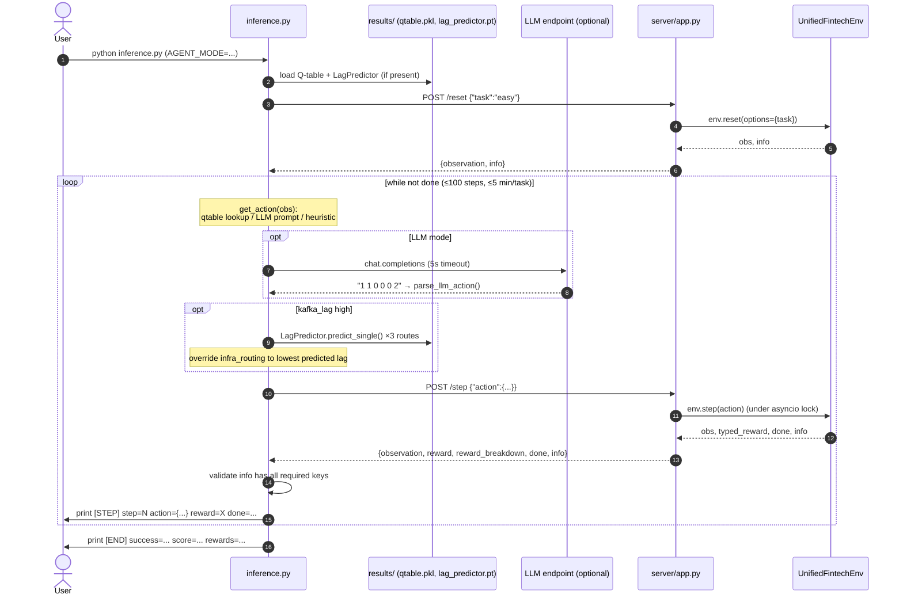

# 09 — The Inference Pipeline

> **Goal:** Trace the complete path from "user starts the system" to "the agent produces an action," through `inference.py` (the client) and `server/app.py` (the server). After this you can explain every line of the live demo, the three agent modes, the world-model override, the strict OpenEnv logging, and the safety guard-rails.

## Table of Contents

1. [What inference *is* (and isn't)](#1-what-inference-is-and-isnt)
2. [The complete request-to-action flow](#2-the-complete-request-to-action-flow)
3. [Configuration via environment variables](#3-configuration-via-environment-variables)
4. [The three agent modes](#4-the-three-agent-modes)
5. [The HTTP helpers](#5-the-http-helpers)
6. [`get_action()` — deciding the action](#6-get_action--deciding-the-action)
7. [The LLM path: prompt, parse, fallback](#7-the-llm-path-prompt-parse-fallback)
8. [The world-model override (Theme 3.1 at inference)](#8-the-world-model-override)
9. [The Q-table policy loader](#9-the-q-table-policy-loader)
10. [The main loop & strict OpenEnv logging](#10-the-main-loop--strict-openenv-logging)
11. [Safety guard-rails](#11-safety-guard-rails)
12. [Key takeaways](#12-key-takeaways)

---

## 1. What inference *is* (and isn't)

`inference.py` is the **OpenEnv agent evaluator**: it drives the environment through all three tasks and prints the strict `[START]/[STEP]/[END]` logs the hackathon grader parses. Crucially, it is a **decoupled HTTP client** — it *never* imports or instantiates `UnifiedFintechEnv`. All environment interaction goes over REST to the server.

```python
# inference.py imports — note what's NOT here
from aepo_types import AEPOAction, AEPOObservation   # the DTOs (shared contract)
from dynamics_model import LagPredictor, build_input_vector  # to load the world model
from graders import get_grader                        # to score trajectories
# NO `from unified_gateway import UnifiedFintechEnv`  ← deliberate decoupling
```

**Why decoupled?** Because the judges' own grader is *also* an HTTP client hitting the *same* endpoints. By making `inference.py` a pure client, it "exercises exactly the same code path that the automated OpenEnv grader uses" — so any server bug (serialization, routing) is caught locally before submission. This is the **client/server separation** rule from Doc 04.

☕ **Java analogy:** `inference.py` is an integration-test client built on `WebClient`, hitting your deployed service's REST API — *not* a unit test that news-up the service bean. It proves the *deployed* thing works, end to end, over the wire.

---

## 2. The complete request-to-action flow

The full journey "user runs inference → agent produces an action → environment responds," as one picture:



The agent's action is "produced" at the **"get_action(obs)"** step — that's the heart. Everything before it sets up; everything after it advances the env and logs. Let's open each piece.

---

## 3. Configuration via environment variables

`inference.py` is configured entirely through environment variables (≈ Spring's `application.properties` / `@Value`):

| Env var | Default | Meaning |
|---------|---------|---------|
| `SPACE_URL` | the HF Space URL | which server to hit |
| `API_BASE_URL` | `http://localhost:11434/v1` | the LLM endpoint (Ollama/HF/OpenAI-compatible) |
| `MODEL_NAME` | `qwen2.5-coder:32b` | which LLM model |
| `HF_TOKEN` | `ollama` | bearer token for the LLM API |
| `AGENT_MODE` | `llm` (or `heuristic` if `DRY_RUN=true`) | which agent drives inference |
| `DRY_RUN` | `false` | legacy alias: `true` → `AGENT_MODE=heuristic` |

☕ **Java analogy:** externalized config read from the environment, with sane defaults — exactly `@Value("${space.url:http://...}")`. Twelve-factor config.

---

## 4. The three agent modes

`AGENT_MODE` selects *who decides the action*:

| Mode | What it does | When to use |
|------|--------------|-------------|
| **`llm`** (default) | Calls the OpenAI-compatible LLM at `API_BASE_URL`, prompts it with the observation, parses 6 integers | The "live LLM agent" demo; what the OpenEnv grader exercises |
| **`qtable`** | Loads `results/qtable.pkl` and acts greedily (argmax) | **Reproduces the documented 0.6650 hard score** without a GPU/LLM — the verifiable evidence path |
| **`heuristic`** | The 3-blind-spot rulebook (no model, no LLM) | The baseline; also the *fallback* when the LLM fails |

This is a clean strategy pattern: three implementations of "produce an action from an observation," chosen by config. ☕ A `@ConditionalOnProperty("agent.mode")` swap between three `AgentStrategy` beans.

💡 **Interview tip:** Know *why* `qtable` mode exists: "It reproduces the trained-agent score deterministically from the committed `qtable.pkl`, so anyone — no GPU, no LLM server — can verify the 0.6650 hard result by running `AGENT_MODE=qtable python inference.py`. It's the auditability path."

---

## 5. The HTTP helpers

Two thin async functions wrap the REST calls (≈ typed `WebClient` methods):

```python
async def http_reset(client, task) -> AEPOObservation:
    response = await client.post("/reset", json={"task": task})
    response.raise_for_status()                         # throw on non-2xx
    return AEPOObservation(**response.json()["observation"])   # JSON → typed DTO

async def http_step(client, action) -> tuple[AEPOObservation, float, bool, dict]:
    response = await client.post("/step", json={"action": action.model_dump()})
    response.raise_for_status()
    data = response.json()
    return (AEPOObservation(**data["observation"]), float(data["reward"]),
            bool(data["done"]), data.get("info", {}))
```
Note the symmetry with the env's in-process API: `http_step` returns the *same* `(obs, reward, done, info)` 4-tuple that `env.step()` returns — so the client code reads identically whether it's talking HTTP or in-process. `action.model_dump()` serializes the typed action to a JSON dict (≈ Jackson). `raise_for_status()` throws on HTTP errors (≈ `WebClient`'s `onStatus`/4xx handling). ☕ Typed REST wrappers that marshal DTOs in and out.

---

## 6. `get_action()` — deciding the action

The dispatcher that produces an action from an observation, branching on `AGENT_MODE`:

```python
def get_action(llm_client, obs, *, agent_mode="llm", qtable_policy=None, current_task="hard") -> AEPOAction:
    if agent_mode == "qtable":
        if qtable_policy is not None:
            return qtable_policy(obs, current_task)     # greedy Q-table lookup
        agent_mode = "llm"                              # fallback if file missing

    if agent_mode == "heuristic":
        norm = obs.normalized()
        # the 3-blind-spot rulebook (identical to graders.heuristic_policy)
        if norm["risk_score"] > 0.8: risk_decision=1; crypto_verify=0   # Reject + FullVerify (blind spot #1)
        else:                        risk_decision=0; crypto_verify=1
        infra_routing = 1 if norm["kafka_lag"] > 0.3 else 0
        db_retry_policy = 1                              # always Backoff (blind spot #3)
        settlement_policy = 1 if norm["rolling_p99"] > 0.6 else 0
        app_priority = 2                                 # always Balanced (blind spot #2)
        return AEPOAction(...)

    # ── live LLM call ──
    norm = obs.normalized()
    user_prompt = f"transaction_type={norm['transaction_type']:.2f} risk_score=... ..."
    try:
        response = llm_client.chat.completions.create(model=MODEL_NAME,
            messages=[{"role":"system","content":SYSTEM_PROMPT},{"role":"user","content":user_prompt}],
            max_tokens=20, temperature=0.0)
        return parse_llm_action(response.choices[0].message.content or "")
    except Exception:
        return get_action(None, obs, agent_mode="heuristic", ...)   # fallback to heuristic
```
Three branches, one return type. The LLM branch has a `try/except` that **falls back to the heuristic** on any failure — a critical robustness choice (next sections). ☕ A strategy dispatcher with a circuit-breaker-style fallback.

---

## 7. The LLM path: prompt, parse, fallback

When `AGENT_MODE=llm`, the action comes from a language model. Three sub-steps:

### The prompt
A constant `SYSTEM_PROMPT` teaches the model its job: it describes all 10 signals, the 6 action fields with their allowed values, decision guidelines (e.g. "risk>0.8 → Reject + SkipVerify is optimal"), and demands "EXACTLY six integers separated by spaces." The `user_prompt` is the current observation formatted as `key=value` pairs. `temperature=0.0` makes the LLM deterministic (always pick its most-likely token). ☕ A prompt template + the request payload — like building a request body from a DTO and a fixed instruction header.

### The parse (`parse_llm_action`)
```python
def parse_llm_action(text) -> AEPOAction:
    SAFE_FALLBACK = AEPOAction(risk_decision=1, crypto_verify=1, infra_routing=0,
                               db_retry_policy=0, settlement_policy=0, app_priority=2)  # Reject+SkipVerify+Normal
    try:
        numbers = re.findall(r"\d+", text.strip().strip("`"))   # extract all integers
        if len(numbers) < 6: return SAFE_FALLBACK
        return AEPOAction(risk_decision=int(numbers[0]), crypto_verify=int(numbers[1]), ...)
        # Pydantic validates ranges → raises if out of range
    except Exception:
        return SAFE_FALLBACK
```
LLMs are unreliable text generators, so the parser is *defensive*: extract the first 6 integers via regex, validate via Pydantic, and on *any* failure return a **safe fallback action**. The fallback is deliberately **Reject + SkipVerify** (not Reject + FullVerify) — because blind spot #1 proves SkipVerify is equally safe and cheaper, and Reject avoids the fraud catastrophe. ☕ Robust deserialization with a safe default — never let a malformed upstream response crash the loop.

### The fallback chain
If the LLM *call itself* fails (timeout, network, rate-limit), `get_action` recurses into heuristic mode. So there are two safety nets: (1) the call fails → heuristic; (2) the call succeeds but the text is malformed → safe fallback action. Either way the episode keeps progressing. **A degraded score beats a zero score** (a crashed task scores 0 on all 100 steps).

---

## 8. The world-model override

This is **Theme 3.1 "world model is load-bearing" at *inference* time** (the training-time half was Dyna-Q in Doc 08). When live lag is dangerous, the agent consults the `LagPredictor` before committing to an infra routing.

```python
def _model_based_infra_override(lag_model, obs, action, step) -> AEPOAction:
    current_lag = obs.normalized()["kafka_lag"]
    if current_lag <= LAG_OVERRIDE_THRESHOLD:   # 0.30 = 3000/10000 raw
        return action                            # below threshold — trust the policy

    best_infra, best_pred = action.infra_routing, float("inf")
    preds = []
    for infra_choice in range(3):                # Normal, Throttle, CircuitBreaker
        candidate = AEPOAction(..., infra_routing=infra_choice, ...)   # same action, vary routing
        pred = lag_model.predict_single(build_input_vector(obs.normalized(), candidate))
        preds.append(pred)
        if pred < best_pred: best_pred, best_infra = pred, infra_choice

    if best_infra != action.infra_routing:
        print(f"[MODEL-PLAN] override:{...}->{...} pred=[N:{preds[0]} T:{preds[1]} CB:{preds[2]}]", file=sys.stderr)
        return AEPOAction(..., infra_routing=best_infra, ...)   # only infra_routing changes
    return action
```

**What it does:** only when `kafka_lag > 0.30` (near the crash band), it asks the world model "if I pick Normal vs Throttle vs CircuitBreaker, what's the predicted next-lag for each?" and overrides `infra_routing` to the lowest-predicted-lag choice. It changes *only* `infra_routing` — all other action fields are untouched. It logs `[MODEL-PLAN]` so the demo can *show* the model intervening at the crash cliff.

This is the most concrete "the world model does something real" moment — and it's locked by four tests in `test_world_model_integration.py` (skipped below threshold, exactly 3 forward passes, can change routing, preserves non-infra fields).

☕ **Java analogy:** before sending a risky request to a struggling downstream, you query a *fast learned predictor* of "what will the queue depth be if I route Normal vs Throttle vs CB?" and pick the safest — a model-in-the-loop guardrail that only kicks in when a metric crosses a danger threshold.

🎤 **Pitch framing:** "When you see `[MODEL-PLAN]` in the inference output, that's the LagPredictor making a real-time intervention the rule-based heuristic cannot." This is your live, visible proof for Theme 3.1.

---

## 9. The Q-table policy loader

For `AGENT_MODE=qtable`, `_load_qtable_policy()` loads `results/qtable.pkl` and returns a greedy policy. It must *exactly* replicate `train.py`'s `obs_to_state` and `decode_action` so state keys match:
```python
_FEATURE_KEYS = ("risk_score","kafka_lag","rolling_p99","db_connection_pool",
                 "bank_api_status","merchant_tier","adversary_threat_level")   # SAME 7 as train.py
def policy_fn(obs, task="hard") -> AEPOAction:
    q_table = snapshots.get(task, snapshots.get("hard", {}))
    state = _obs_to_state(obs.normalized())
    action_idx = int(np.argmax(q_table[state])) if state in q_table else _SAFE_IDX
    return _decode_action(action_idx)
```
For a known state, return the argmax action; for an unknown state, return a safe default (Reject+SkipVerify+Normal). The discretization (7 features, 4 bins) and the action decoding (mixed-radix strides 72,36,12,6,3,1) are **copied verbatim** from `train.py` — they *must* match or the loaded Q-values would be looked up under the wrong keys. ☕ A deserializer + lookup that must use the identical hashing/encoding as the writer; a schema mismatch would silently corrupt lookups.

⚠️ **Subtle coupling (interview-worthy):** `inference.py` re-implements the discretization rather than importing it from `train.py`. That's intentional decoupling (inference shouldn't depend on the trainer), but it means the two copies must be kept in sync. A divergence would be a nasty, silent bug — exactly the kind of thing the tests guard.

---

## 10. The main loop & strict OpenEnv logging

`main()` runs all three tasks, and its output format is **contractually strict** — the grader parses stdout with a per-line regex, so the exact format matters.

```python
for task in ["easy", "medium", "hard"]:
    print(f"[START] task={task} env=aepo model={MODEL_NAME}", flush=True)
    obs = await http_reset(http, task)
    while not done:
        action = get_action(llm_client, obs, agent_mode=AGENT_MODE, ...)
        if lag_predictor is not None:
            action = _model_based_infra_override(lag_predictor, obs, action, current_step+1)
        obs, reward, done, info = await http_step(http, action)
        missing = _REQUIRED_INFO_KEYS - info.keys()
        if missing: raise RuntimeError(f"Server info dict missing keys: {missing}")  # fail loud
        print(f"[STEP]  step={current_step} action={action.model_dump_json()} "
              f"reward={reward:.2f} done={done_str} error=null", flush=True)
    grader = get_grader(task)
    task_score = grader.grade(trajectory)              # legacy trajectory scoring
    success = "true" if task_score >= _TASK_THRESHOLDS[task] else "false"
    print(f"[END]   success={success} steps={total_steps} score={task_score:.2f} rewards={rewards_csv}", flush=True)
```

The three log line types the grader reads:
- `[START] task=... env=aepo model=...` — episode begins.
- `[STEP]  step=N action={json} reward=X.XX done=true|false error=null` — one per step. Note `reward={reward:.2f}` (2 decimals, spec-required) and `action={action.model_dump_json()}` (the action as JSON).
- `[END]   success=... steps=... score=X.XX rewards=csv` — episode summary, score from the per-task grader.

⚠️ **Why `flush=True` everywhere?** So each line is written *immediately* (not buffered) — the grader reads streaming stdout, and buffered output could arrive out of order or late. ☕ Like `System.out.flush()` after each log line when a downstream parser tails your stdout.

**Info validation:** `_REQUIRED_INFO_KEYS - info.keys()` computes the set difference; if the server omitted any required key, it raises immediately. This catches server serialization bugs at the client, loudly, instead of silently scoring 0.

The **error sanitization** in the exception handler is a beautiful piece of defensive engineering: if a step throws, the error string is stripped of newlines/tabs and wrapped in quotes before being printed in the `[STEP]` line — because the grader's per-line regex would break if an exception message (e.g. an HTTP body with newlines) split the line across multiple lines, scoring the whole task 0. ☕ Sanitizing a value before it goes into a structured log line a parser depends on.

---

## 11. Safety guard-rails

`inference.py` is hardened for the live-demo reality (slow LLMs, cold HF Spaces, flaky networks). The guard-rails, each defending the "< 20 min, never score 0" goal:

| Guard-rail | Mechanism | Why |
|------------|-----------|-----|
| **Per-LLM-call timeout** | `LLM_CALL_TIMEOUT_SEC = 5.0` on the OpenAI client | one stuck call won't burn the budget |
| **Per-task wall budget** | `TASK_WALL_BUDGET_SEC = 300.0` (5 min/task) | a slow task ends early with collected rewards, not a total failure |
| **LLM failure → heuristic** | `try/except` in `get_action` | network/timeout doesn't zero the task |
| **Malformed output → safe action** | `parse_llm_action` fallback | bad text doesn't crash the loop |
| **Missing model weights → disabled** | `_load_lag_predictor` returns None if file absent | inference runs even without pre-training |
| **Missing qtable → LLM fallback** | `_load_qtable_policy` returns None | graceful degradation |
| **Info-key validation** | `_REQUIRED_INFO_KEYS` check | server bugs surface immediately |
| **Error sanitization** | strip newlines from exception strings | protects the grader's line parser |
| **Persistent HTTP client** | one `AsyncClient` across all tasks | reuse TCP connection, lower latency |

The philosophy: **a degraded result beats a zero result.** A 100-step task that fails on step 1 scores 0 on all 100 steps; falling back to the heuristic for a few steps keeps the score real.

☕ **Java analogy:** this is exactly the resilience layer you'd put around a flaky downstream — timeouts, fallbacks, bulkheads, graceful degradation (Resilience4j circuit-breaker + fallback). A production-minded inference client, not a happy-path script.

💡 **Interview tip:** "How did you make the live demo robust?" → cite the timeout + wall-budget + heuristic-fallback triad: "Each LLM call is capped at 5s, each task at 5 min, and any failure falls back to the heuristic — so worst case we degrade to a competent baseline rather than scoring zero. We also sanitize error strings so a multi-line exception can't break the grader's line parser."

---

## 12. Key takeaways

- `inference.py` is a **decoupled HTTP client** — it never touches `UnifiedFintechEnv` directly, only the DTOs and the REST API, so it exercises the exact path the judges' grader uses.
- It supports **three agent modes**: `llm` (default), `qtable` (reproduces the 0.6650 score deterministically), `heuristic` (baseline + fallback).
- The action is "produced" in **`get_action()`**; the LLM path prompts the model, **parses 6 integers defensively**, and **falls back to a safe action / the heuristic** on any failure.
- The **world-model override** (`_model_based_infra_override`) queries the `LagPredictor` for all 3 routing options when lag is dangerous and picks the safest — Theme 3.1 *at inference*, logged as `[MODEL-PLAN]`.
- The **Q-table loader** must replicate `train.py`'s discretization/encoding *exactly* (a subtle, test-guarded coupling).
- The main loop emits **strict, flushed `[START]/[STEP]/[END]` logs** the grader parses by regex; **info-key validation** and **error sanitization** protect that contract.
- The **guard-rails** (timeouts, wall budget, fallbacks, graceful degradation) embody "a degraded result beats a zero result" — production-grade resilience, not a happy-path script.

### Summary

You can now trace the live demo end to end: configure → load artifacts → reset → (decide action → maybe override with the world model → step → log) × 100 → grade → report, with resilience at every failure point. Together with Doc 08 (training), you understand the full lifecycle of producing *and* using a trained agent. Next, Doc 10 covers getting it into the world: Docker, Hugging Face Spaces, the OpenEnv contract, and the frontend — the deployment story.

➡️ Next: [10_Deployment.md](10_Deployment.md)
