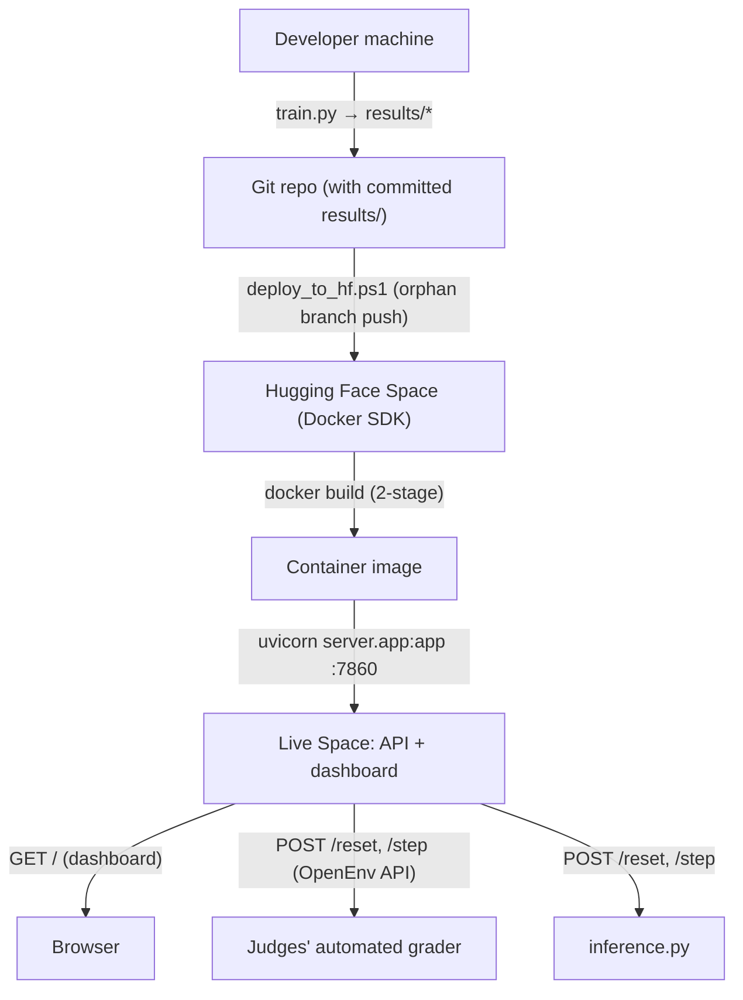

# 10 — Deployment & Technology Deep-Dive

> **Goal:** Two things. First, how AEPO ships: Docker, Hugging Face Spaces, OpenEnv validation, the one-container "API + dashboard" trick, and the deploy/validation scripts. Second, the comprehensive **technology deep-dive** you asked for — every tool answered with *what / why / why chosen / alternatives / where used* — including honest coverage of the technologies the project deliberately does **not** use.

## Table of Contents

1. [The deployment picture](#1-the-deployment-picture)
2. [Docker for Java developers](#2-docker-for-java-developers)
3. [The production `Dockerfile` (two-stage)](#3-the-production-dockerfile-two-stage)
4. [One container, two surfaces (API + dashboard)](#4-one-container-two-surfaces)
5. [Hugging Face Spaces](#5-hugging-face-spaces)
6. [OpenEnv — the contract & the CLI](#6-openenv--the-contract--the-cli)
7. [The training Space (`Dockerfile.training`)](#7-the-training-space)
8. [The deploy & validation scripts](#8-the-deploy--validation-scripts)
9. [Technology deep-dive — what's used](#9-technology-deep-dive--whats-used)
10. [Technology deep-dive — what's NOT used (and why)](#10-technology-deep-dive--whats-not-used-and-why)
11. [Key takeaways](#11-key-takeaways)

---

## 1. The deployment picture



The flow: train locally → commit the artifacts (`results/`) → push to a Hugging Face Space → the Space builds the Docker image → the container runs the FastAPI server on port 7860, serving *both* the OpenEnv API and the dashboard. Judges' graders and `inference.py` hit the same endpoints.

---

## 2. Docker for Java developers

You know Docker from the JVM world, so this is quick. A **Docker image** is a packaged filesystem snapshot (OS + runtime + your app + deps); a **container** is a running instance of an image. The differences for the *Python* ecosystem vs your usual Spring Boot Dockerfile:

| Concept | Spring Boot Docker | AEPO (Python) Docker |
|---------|--------------------|-----------------------|
| Base image | `eclipse-temurin:21-jre` | `python:3.10-slim` |
| Dependency install | `COPY app.jar` (deps baked into the fat JAR) | `pip install -r requirements.txt` (deps installed into the image) |
| Build artifact | one fat JAR | the interpreter + `site-packages` + your `.py` files |
| Run command | `java -jar app.jar` | `uvicorn server.app:app --port 7860` |
| Multi-stage | build with Maven, run with JRE | build frontend with Node, run with Python |

The mental model is identical; only the runtime and the dependency mechanism differ. ☕ "`pip install` into the image" is the Python equivalent of "Maven resolves deps into the fat JAR" — both end with all dependencies present in the image.

---

## 3. The production `Dockerfile` (two-stage)

AEPO's `Dockerfile` is a **multi-stage build** — exactly the pattern you use to keep Spring Boot images slim (build with full toolchain, run with minimal runtime).

**Stage 1 (`frontend-build`, Node 20):** builds the Next.js dashboard to a *static export* (`out/`) — plain HTML/JS/CSS that needs no Node runtime.
```dockerfile
FROM node:20-alpine AS frontend-build
COPY frontend/package.json frontend/package-lock.json ./
RUN npm ci --prefer-offline          # install deps (like mvn dependency:resolve)
COPY frontend/ ./
RUN npm run build                    # produces out/ (static export)
```

**Stage 2 (`runtime`, Python 3.10-slim):** installs Python deps, copies only the submission files + `results/` + the built frontend, runs as non-root, exposes 7860, launches uvicorn.
```dockerfile
FROM python:3.10-slim AS runtime
ENV OMP_NUM_THREADS=1 ...            # pin BLAS threads (small CPU, avoid oversubscription)
RUN useradd -m -u 1000 user          # HF Spaces requires UID 1000 (non-root)
COPY requirements.txt .
RUN sed -e '/^--extra-index-url/d' -e '/^torch==/d' requirements.txt > /tmp/req_base.txt \
    && pip install -r /tmp/req_base.txt \
    && pip install "https://download.pytorch.org/whl/cpu/torch-2.2.0%2Bcpu-...whl"   # CPU torch by URL
COPY aepo_types.py unified_gateway.py dynamics_model.py graders.py inference.py openenv.yaml ./
COPY server/ ./server/
COPY results/ ./results/             # the trained Q-table + weights (needed at runtime)
COPY --from=frontend-build /build/out ./frontend/out   # bring the built dashboard across stages
USER user
EXPOSE 7860
HEALTHCHECK ... CMD python -c "import urllib.request; urllib.request.urlopen('http://localhost:7860/')"
CMD ["uvicorn", "server.app:app", "--host", "0.0.0.0", "--port", "7860", "--workers", "2"]
```

The clever, interview-worthy details:
- **CPU-only torch installed *by URL*** (not from the simple index) to avoid a SHA mismatch and to get the slim ~170MB CPU wheel instead of the multi-GB CUDA build. This is the "deployment efficiency" theme made concrete.
- **`COPY --from=frontend-build`** pulls the built static site across stages — the runtime image never contains Node or `node_modules`.
- **Non-root UID 1000** because HF Spaces runs containers as that user; matching it prevents permission errors.
- **Thread-pinning env vars** (`OMP_NUM_THREADS=1`, etc.) keep NumPy/Torch from oversubscribing the 2 vCPUs.
- **`HEALTHCHECK`** probes `GET /` — both HF Spaces and `openenv validate` expect that to return 200.

☕ It's the same discipline as your slim Spring Boot images: build-time toolchain in an early stage, minimal runtime in the final stage, non-root user, healthcheck, explicit port. The `.dockerignore` excludes `.venv/`, `java-mirror/`, `tests/`, `docs/`, `*.ipynb`, etc. — keeping the build context (and image) small, the same role as your `.dockerignore`.

---

## 4. One container, two surfaces

A neat architectural trick: **the same FastAPI process serves both the OpenEnv API and the dashboard.** From `server/app.py`:
```python
# explicit API routes registered first: /reset, /step, /state, /contract, /
# then, LAST:
if os.path.isdir(_FRONTEND_OUT):
    app.mount("/", StaticFiles(directory=_FRONTEND_OUT, html=True), name="frontend")
```
FastAPI resolves explicit routes (`POST /reset`, etc.) *before* falling through to the catch-all static mount at `/`. So:
- `GET /` → the dashboard HTML.
- `POST /reset`, `POST /step`, `GET /state` → the API.

One port (7860), one process, both surfaces — no separate web server for the UI. The `if os.path.isdir` guard means local dev (no built frontend) still starts cleanly. ☕ Like serving a built SPA from `src/main/resources/static` while your `@RestController` routes stay authoritative — one Spring Boot app serving API + UI.

---

## 5. Hugging Face Spaces

**What it is:** Hugging Face Spaces is a free hosting platform for ML demos — you push a repo, it builds and runs it, giving you a public URL. AEPO uses the **Docker SDK** Space type (you provide a Dockerfile; HF builds and runs it).

**How AEPO uses it:** the `README.md` front-matter configures the Space:
```yaml
---
title: Autonomous Enterprise Payment Orchestrator
sdk: docker
app_port: 7860
tags: [openenv]      # required so HF's OpenEnv discovery finds it
---
```
HF reads this, builds the `Dockerfile`, runs the container, and routes external traffic to port 7860. The Space has two URLs: a browser URL (`huggingface.co/spaces/...`) showing the dashboard, and an API URL (`...hf.space`) for the OpenEnv endpoints.

**Why chosen:** free, supports Docker, integrates with the hackathon's OpenEnv discovery (the `openenv` tag), and sized for the same 2-vCPU class the graders use. **Alternatives:** any PaaS (Heroku, Railway, Cloud Run, Fly.io) or a VM — but HF Spaces is the hackathon's native target and free. ☕ A free, git-push-to-deploy PaaS, like Heroku/Cloud Run but ML-flavored and OpenEnv-aware.

⚠️ **The "cold start" gotcha:** free Spaces *sleep* when idle and take ~30s to wake. This is why `inference.py` has generous HTTP timeouts and the validation script notes "Space may be sleeping." Worth mentioning if asked about production reliability.

---

## 6. OpenEnv — the contract & the CLI

**What it is:** OpenEnv is the hackathon's standard for "an RL environment an agent can be trained/evaluated against." It's two things: (1) a **contract** your environment must satisfy (specific `reset()`/`step()`/`state()` semantics, typed obs/action, rewards in a declared range, a manifest), and (2) a **CLI** (`openenv validate`) that checks compliance.

**How AEPO satisfies it:**
- `openenv.yaml` declares the entry point (`unified_gateway:UnifiedFintechEnv`), the reward range `[0,1]`, the three tasks with thresholds, and the obs/action space schemas.
- `UnifiedFintechEnv` implements the **4-tuple** `step()` contract (Doc 04 §8) — and exposes `IS_OPENENV_COMPLIANT`/`STEP_TUPLE_FORMAT` plus a `GET /contract` endpoint advertising it.
- The server exposes `POST /reset`, `POST /step`, `GET /state` — the OpenEnv HTTP surface.
- `GymnasiumCompatWrapper` bridges to Gymnasium's 5-tuple *only* for `check_env` CI.

**Why it matters:** compliance is what lets the judges' automated grader drive *any* OpenEnv submission generically — your env, hitting the standard endpoints, returning the standard shapes. ☕ OpenEnv is an **interface + its TCK (Technology Compatibility Kit)**: implement the interface, pass the `validate` conformance suite, and the platform can use your implementation interchangeably. `openenv validate .` ≈ running the TCK.

The README documents a passing run: `[OK] Ready for multi-mode deployment` with `openenv_serve`, `uv_run`, and `python_module` modes green.

---

## 7. The training Space

`Dockerfile.training` is a **separate** image for the GPU GRPO training, deployed as its *own* A10G Space (distinct from the production server Space):
```dockerfile
FROM nvidia/cuda:12.1.1-cudnn8-runtime-ubuntu22.04   # CUDA base (GPU)
RUN apt-get install python3.11 ... && git clone <AEPO repo>
RUN pip install -r requirements.txt
RUN pip install "unsloth[colab-new] @ git+...", "trl>=0.15.0", peft, accelerate, bitsandbytes, datasets
CMD ["/entrypoint.sh"]    # runs train_grpo_hf.py, then serves results/ on :7860
```
The entrypoint runs `train_grpo_hf.py` on the GPU, pushes the LoRA adapter to HF Hub, then serves the `results/` directory so you can download the reward curve. **Why separate from production?** Training needs a GPU + heavy libs (Unsloth, bitsandbytes, ~GB of CUDA); the production server needs only CPU torch + FastAPI. Keeping them apart keeps the *serving* image slim (the deployment-efficiency theme). ☕ A separate "batch/ETL job" image vs the lean "service" image — you'd never bundle your nightly Spark job's deps into your API container.

---

## 8. The deploy & validation scripts

### `validate-submission.sh` — the pre-flight checklist
A bash script (`set -e` = abort on first failure) running four checks before submission:
1. **HF Space liveness:** `GET /` returns 200 and `POST /reset {"task":"easy"}` returns 200.
2. **Docker build:** `docker build` succeeds locally.
3. **`openenv validate .`** passes (it even patches the openenv CLI to use the `tomli` backport on Python 3.10, where `tomllib` isn't stdlib — a nice compatibility touch).
4. **`pytest tests/`** all pass.
It prints colored PASS/FAIL and exits non-zero if anything failed. ☕ A CI `verify` stage / a pre-push git hook bundling smoke + build + conformance + unit tests.

### `deploy_to_hf.ps1` — the clean-history deploy
A PowerShell script that pushes to the HF Space via an **orphan branch** (history-free):
```powershell
git checkout --orphan hf-deploy-clean    # a branch with NO history
git rm -rf --cached .; git add -A; git commit -m "Clean deploy to HF Space"
git push space hf-deploy-clean:main -f   # force-push as the Space's main
git checkout main; git branch -D hf-deploy-clean
```
**Why an orphan branch?** HF Spaces rejects pushes with large binaries in *history* (the repo accumulated `.png`/`.pt`/`.pkl` artifacts over many commits). An orphan branch has a single commit with only the current files, sidestepping the "binary files in history" limit. ☕ A "squash everything into one clean commit for the deploy remote" trick — like deploying a clean artifact instead of your whole dev history.

---

## 9. Technology deep-dive — what's used

The full *what / why / why chosen / alternatives / where* for every technology actually in AEPO.

### Python 3.10
- **What:** the language. **Why:** the lingua franca of ML/RL — every library (PyTorch, Gymnasium, FastAPI, TRL) is Python-first. **Why this version:** pinned `>=3.10,<3.11` for library compatibility (some deps lag on 3.11+). **Alternatives:** Java (DJL/DL4J) — rejected because the ML ecosystem is overwhelmingly Python and the hackathon expects it. **Where:** everything.

### pip + `requirements.txt`
- **What:** the package installer + dependency list. **Why:** standard, universal, works in Docker. **Alternatives:** `uv` (also present, faster), `poetry`, `conda`. **Where:** `requirements.txt`, the Dockerfile.

### uv + `pyproject.toml` + `uv.lock`
- **What:** a fast modern package manager + project metadata + a reproducible lockfile. **Why:** much faster than pip, reproducible installs. **Alternatives:** pip+venv (used as the baseline), poetry. **Where:** `pyproject.toml`, `uv.lock`. ☕ Gradle-vs-Maven: uv is the faster newer tool, pip is the established one; the project ships both.

### virtual environment (`.venv`)
- **What:** per-project isolated library folder. **Why:** prevents cross-project version conflicts. **Alternatives:** global installs (conflict-prone), conda envs, Docker-only. **Where:** `.venv/`. ☕ a project-local classpath / `.m2`.

### Pydantic v2
- **What:** typed, self-validating data models. **Why:** free validation + serialization for the obs/action DTOs; out-of-range input rejected at construction → automatic HTTP 422. **Why chosen:** the de-facto Python validation library; FastAPI is built on it. **Alternatives:** `dataclasses` (no validation), `attrs`, manual checks. **Where:** `aepo_types.py`, `unified_gateway.py` (`UFRGReward`), the server. ☕ Bean Validation (`@Valid`) on `record`s + Jackson.

### Gymnasium
- **What:** the standard RL environment interface (`Env` with `reset()`/`step()`, `observation_space`/`action_space`). **Why:** the universal RL contract — tooling, wrappers, and `check_env` all assume it. **Why this version:** `0.29.1` pinned because it uses the API shape AEPO targets. **Alternatives:** the original OpenAI `gym` (deprecated; Gymnasium is its maintained successor), PettingZoo (multi-agent), DeepMind `dm_env`. **Where:** `UnifiedFintechEnv(gym.Env)`, `spaces.Box`/`spaces.MultiDiscrete`. ☕ a framework SPI you implement (like `WebMvcConfigurer`) so generic tooling can drive your class.

### NumPy
- **What:** fast numeric arrays + vectorized math. **Why:** the substrate of all numeric Python; `Box` spaces, observation vectors, Q-value arrays, clipping, percentiles. **Alternatives:** pure Python lists (far slower), `cupy` (GPU). **Where:** everywhere numeric. ☕ a vectorized `double[]` + math library; `np.clip` = `Math.max/min`, `np.argmax` = index-of-max.

### PyTorch (CPU build)
- **What:** the deep-learning framework — build neural nets, autodiff, optimizers. **Why:** industry standard, what the hackathon (Meta PyTorch) centers on; powers both world models and the LLM training. **Why CPU build:** the serving/training-baseline must run on 2 vCPU / 8 GB with no GPU — the CPU wheel is ~170MB vs multi-GB CUDA. **Alternatives:** TensorFlow/JAX (different ecosystem), DJL/DL4J (Java — far less mature for this). **Where:** `dynamics_model.py`, `train.py`, `train_grpo_hf.py`. ☕ no clean Java equivalent; closest is DJL.

### FastAPI
- **What:** an async Python web framework for REST APIs. **Why:** minimal, Pydantic-native (validation + OpenAPI for free), async. **Why chosen:** least-friction way to expose the env as the OpenEnv HTTP surface; Pydantic models become request/response bodies with zero glue. **Alternatives:** Flask (sync, more boilerplate), Django (heavy), Starlette (lower-level — FastAPI sits on it). **Where:** `server/app.py`. ☕ Spring Boot `@RestController` — `@app.post("/step")` = `@PostMapping("/step")`, Pydantic body = `@RequestBody @Valid`.

### Uvicorn
- **What:** the ASGI server that runs the async FastAPI app. **Why:** FastAPI needs an ASGI server; Uvicorn is the standard. **Alternatives:** Hypercorn, Daphne; Gunicorn-with-Uvicorn-workers for multi-process. **Where:** the Dockerfile `CMD`, `server/app.py:main()`. ☕ embedded Tomcat/Netty under Spring Boot.

### httpx
- **What:** an async HTTP client. **Why:** `inference.py` needs to call the server concurrently with timeouts and connection reuse. **Alternatives:** `requests` (sync), `aiohttp`. **Where:** `inference.py`. ☕ `WebClient` (reactive) vs `RestTemplate` (blocking) — httpx is the `WebClient` here.

### OpenAI SDK
- **What:** a client for OpenAI-compatible chat APIs. **Why:** lets `inference.py` talk to *any* OpenAI-compatible LLM endpoint (Ollama, HF router, vLLM) with one interface. **Alternatives:** raw httpx to the LLM, vendor-specific SDKs. **Where:** `inference.py` (`llm` mode). ☕ a vendor SDK with a pluggable base URL.

### TRL + Unsloth + PEFT/LoRA + bitsandbytes
- **What:** the GPU LLM-fine-tuning stack. **TRL** = the GRPO trainer; **Unsloth** = speed/memory optimizations + 4-bit loading; **PEFT/LoRA** = train tiny adapters not the whole model; **bitsandbytes** = 4-bit quantization. **Why:** make fine-tuning a 7B model feasible on a single 24GB GPU. **Alternatives:** full fine-tuning (needs far more VRAM), other RLHF libs. **Where:** `train_grpo_hf.py`, `Dockerfile.training`. ☕ a heavyweight ML training framework — no Java analog.

### GRPO (the algorithm)
- **What:** Group Relative Policy Optimization — generate several actions per prompt, score each with the env reward, reinforce the better-than-group ones. **Why:** a stable, modern policy-gradient method for LLMs that needs only a scalar reward (which the env provides). **Alternatives:** PPO (more complex, needs a value model), DPO (needs preference pairs, not a reward function). **Where:** `train_grpo_hf.py`. ☕ "generate N candidates, rank by a scoring function, nudge toward winners."

### Tabular Q-learning + Dyna-Q (the primary algorithm)
- **What:** learn a Q-table by Bellman updates; augment with world-model "imagined" updates. **Why:** runs on CPU in <20 min, fully reproducible, explainable. **Alternatives:** deep RL (DQN/PPO — heavier, GPU, less reproducible). **Where:** `train.py`. ☕ an iterative `Map<State,double[]>` refinement loop.

### Docker + Hugging Face Spaces + OpenEnv
- Covered in §2–7 above.

### Next.js / React / TypeScript / Tailwind / Recharts
- **What:** the dashboard stack — Next.js (React framework, static export), React (UI library), TypeScript (typed JS), Tailwind (utility CSS), Recharts (charts), lucide-react (icons). **Why:** a modern, fast way to build the real-time SRE cockpit; static export means no Node runtime in production. **Alternatives:** Angular, Vue, plain HTML+JS. **Where:** `frontend/`. ☕ an Angular/React SPA on a Spring backend.

### pytest (+ pytest-cov)
- **What:** the test framework + coverage plugin. **Why:** the Python standard; 221 tests, 97% coverage. **Alternatives:** `unittest` (stdlib, more verbose), `nose`. **Where:** `tests/`. ☕ JUnit + JaCoCo.

### matplotlib (+ seaborn)
- **What:** plotting libraries. **Why:** generate the reward/staircase/dyna-comparison charts headlessly (`Agg` backend, no display). **Alternatives:** plotly, bokeh. **Where:** `train.py`, `train_grpo_hf.py`. ☕ a server-side chart/report generator (JFreeChart).

---

## 10. Technology deep-dive — what's NOT used (and why)

The user's list mentioned several technologies AEPO **deliberately doesn't use**. Knowing *why not* is excellent interview defense — judges love "why didn't you use X?"

| Technology | What it is | Why AEPO doesn't use it |
|------------|-----------|--------------------------|
| **Stable-Baselines3 (SB3)** | A popular library of ready-made deep-RL algorithms (PPO, DQN, A2C…) on PyTorch | AEPO's primary agent is **tabular Q-learning** (CPU, <20 min, reproducible, explainable). SB3's deep-RL would need a GPU, more time, and is less reproducible — overkill for a proof-of-learning baseline. The env *can* be wrapped (`GymnasiumCompatWrapper`) for SB3 if desired. |
| **PPO (Proximal Policy Optimization)** | A widely-used policy-gradient deep-RL algorithm | Same reason — AEPO uses Q-learning for the CPU baseline and **GRPO** (a PPO cousin) for the LLM. PPO needs a learned value network; GRPO doesn't, which suits the LLM setting. |
| **Maskable PPO** | PPO variant that masks invalid actions | AEPO's action space has *no* invalid actions (all 216 combos are legal; each just has different rewards), so action masking is unnecessary. |
| **Pandas** | DataFrames for tabular data analysis | AEPO's data is small numeric vectors and dicts; NumPy + plain Python suffice. No CSV/dataframe workflows. |
| **TensorBoard** | A training-metrics dashboard (logs curves live) | AEPO logs to stdout and renders final PNG charts with matplotlib; the *frontend dashboard* covers live visualization. TensorBoard would be redundant. |
| **OpenAI Gym (original)** | The predecessor to Gymnasium | Deprecated and unmaintained; **Gymnasium** is its official successor and what AEPO uses. |
| **TensorFlow / JAX** | Alternative deep-learning frameworks | The hackathon is **Meta PyTorch**; PyTorch is the natural and expected choice. |
| **Kubernetes** | Container orchestration | Single-container deploy to HF Spaces; no orchestration needed. |

💡 **Interview tip:** "Why tabular Q-learning instead of PPO/Stable-Baselines3?" → "Three reasons: it runs on 2 vCPU in under 20 minutes with no GPU (the deployment-efficiency theme), it's fully reproducible (seed → identical Q-table → identical blind-spot-discovery episode), and it's *explainable* — I can point at a state and read off the learned action. PPO/SB3 would add GPU dependency, training variance, and opacity for no benefit on a discretizable 16,384-state problem. For the *LLM* path I use GRPO, which is the policy-gradient method that fits language models — so I used the right tool for each agent type."

---

## 11. Key takeaways

- **Deploy flow:** train locally → commit `results/` → push to a Hugging Face **Docker Space** → it builds the **two-stage Dockerfile** (Node builds the dashboard, Python runs the server) → **one container serves both the OpenEnv API and the dashboard** on port 7860.
- The Dockerfile's craft: **CPU-only torch by URL** (slim image), **non-root UID 1000** (HF requirement), **thread-pinning** (small CPU), **healthcheck on `GET /`**, and a tight `.dockerignore`.
- **OpenEnv** is an interface + its conformance CLI (`openenv validate`); AEPO satisfies it via `openenv.yaml`, the 4-tuple `step()`, and the REST endpoints. **HF Spaces** is a free Docker PaaS (with a cold-start gotcha).
- A **separate** `Dockerfile.training` (CUDA base) runs GPU GRPO training, keeping the serving image lean. `validate-submission.sh` is the pre-flight CI; `deploy_to_hf.ps1` uses an **orphan branch** to dodge the "binaries in history" limit.
- The **technology stack** maps cleanly to your Java world (FastAPI=Spring Boot, Uvicorn=Tomcat, Pydantic=Bean Validation, pytest=JUnit, Docker=Docker); the genuinely new pieces are **PyTorch, Gymnasium, and the TRL/Unsloth/LoRA** GPU stack.
- Know **why the unused tech is unused**: tabular Q-learning over PPO/SB3 (CPU, reproducible, explainable); GRPO over PPO for the LLM; no Pandas/TensorBoard needed.

### Summary

You can now explain how AEPO ships and justify every technology choice — including the ones you *didn't* make. That completes the "how it's built and run" arc (Docs 04–10). The remaining documents are for *mastery and recall*: Doc 11 is a 100+ question interview drill, Doc 12 is an FAQ, Doc 13 a glossary, Doc 14 a one-page cheat sheet, Doc 15 a 5-minute summary, and Doc 16 production-incident runbooks.

➡️ Next: [11_Interview_Preparation.md](11_Interview_Preparation.md)
