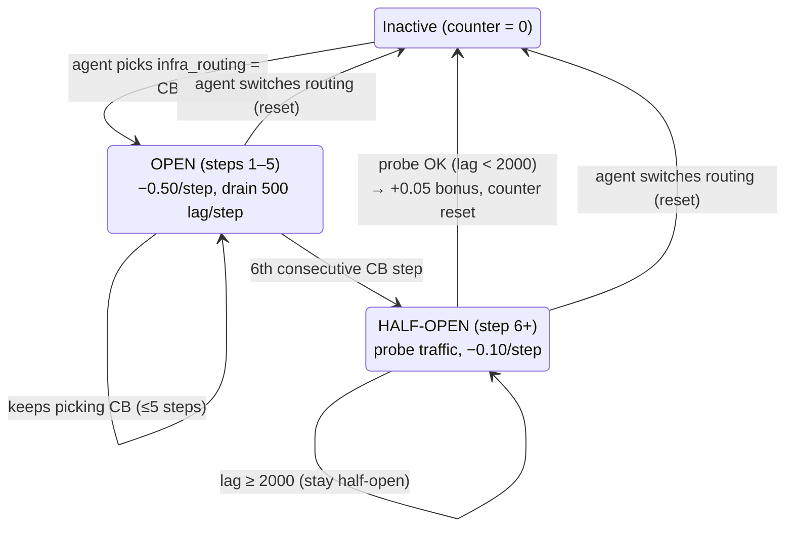

# 17 — Resume Defense: Every Claim, Verified & Explained

> **Goal:** Your resume bullets are *promises* — every phrase on them is an invitation for an interviewer to dig. This document takes your four AEPO bullets **verbatim**, verifies every number against the actual code, decodes every technical phrase, teaches the concept behind it, and gives you the answer to the question each phrase will trigger. After this, there is nothing on your resume you can't defend for five minutes.

## Your resume bullets (verbatim)

> **AEPO: Autonomous Enterprise Payment Orchestrator | Grand Finale | GitHub | HuggingFace**
> - Designed a causally-structured OpenEnv simulation of a UPI payment gateway with 11 deterministic state transitions modeling real-world infra dynamics — Kafka lag cascades, circuit-breaker FSM, bank API flapping, and P99 latency EMA
> - Trained Q-table achieved 0.6650 on the hard task — 2.25× a hand-built SRE heuristic baseline (0.2955) and 2.66× random policy; reward shaping across a 6-dimensional action space (216 combinations/step) with 20+ hierarchical reward branches, designed to prevent degenerate policies
> - Implemented a PyTorch LagPredictor MLP wired into Dyna-Q training (5 imagined rollouts/step); discovered a blind-spot policy (Reject + SkipVerify on high-risk transactions) emergently across 167 captured instances — a pattern the hand-coded heuristic never found
> - Shipped 221 tests at 97% coverage on core environment; dual-mode FastAPI + standalone execution; CPU-only Docker deployment (2 vCPU / 8 GB) on HuggingFace Spaces

## Table of Contents

1. [The fact-check table (every number, verified)](#1-the-fact-check-table)
2. [⚠️ Three precision flags — fix or be ready to defend](#2-three-precision-flags)
3. [Bullet 1 — the environment claim](#3-bullet-1--the-environment-claim)
4. [Bullet 2 — the results claim](#4-bullet-2--the-results-claim)
5. [Bullet 3 — the world-model & discovery claim](#5-bullet-3--the-world-model--discovery-claim)
6. [Bullet 4 — the engineering claim](#6-bullet-4--the-engineering-claim)
7. [The header line — Grand Finale / GitHub / HuggingFace](#7-the-header-line)
8. [The 90-second narrative that stitches the four bullets](#8-the-90-second-narrative)
9. [Rapid-fire drill (15 one-liners)](#9-rapid-fire-drill)
10. [Key takeaways](#10-key-takeaways)

---

## 1. The fact-check table

Every quantitative claim on your resume, checked against the codebase and documented results. **Green = verified as written. Yellow = defensible but needs a prepared answer (see §2).**

| Resume claim | Verified value | Source | Status |
|---|---|---|---|
| 11 state transitions | 11 causal transitions listed & implemented | `unified_gateway.py` docstring + `step()`/`_generate_phase_observation()` | 🟢 |
| "deterministic" transitions | Formulas fixed; several have *seeded stochastic* components | transitions #6, #10, noise terms | 🟡 §2 |
| 0.6650 on hard task | 0.6650 (trained Q-table, hard grader, 10 eps, seed 44) | `README.md` results table; reproduce via `AGENT_MODE=qtable` | 🟢 |
| 2.25× heuristic (0.2955) | 0.6650 / 0.2955 = **2.2504** | README | 🟢 |
| 2.66× random | 0.6650 / 0.2507 = **2.6526 → 2.65×** | README (random hard = 0.2507) | 🟡 §2 |
| 6-dimensional action space | `MultiDiscrete([3,2,3,2,2,3])` | `unified_gateway.py`, `openenv.yaml` | 🟢 |
| 216 combinations/step | 3×2×3×2×2×3 = 216 | `train.py` `N_ACTIONS=216` | 🟢 |
| 20+ hierarchical reward branches | ~23 distinct branches counted in `step()` | reward section of `step()` | 🟢 |
| LagPredictor MLP | Linear(16→64)→ReLU→Linear(64→1)→Sigmoid, PyTorch | `dynamics_model.py` | 🟢 |
| 5 imagined "rollouts"/step | `DYNA_PLANNING_STEPS = 5` — five **one-step** imagined updates | `train.py` `DynaPlanner.plan()` | 🟡 §2 |
| 167 captured instances | 167 blind-spot-#1 events at seed 44 (first: ep 335, step 41) | `results/blind_spot_events.json`, README | 🟢 |
| Heuristic never found it | Heuristic hard-codes FullVerify on reject → can never trigger the flag | `graders.py` `heuristic_policy`; `tests/test_heuristic.py` | 🟢 |
| 221 tests, 97% coverage | 221 tests; 97% on `unified_gateway.py` | README badges; `pytest --cov` | 🟢 |
| Dual-mode FastAPI + standalone | Same env class in-process & behind HTTP; equality test-locked | `server/app.py`; `tests/test_dual_mode.py` | 🟢 |
| CPU-only Docker, 2 vCPU / 8 GB | `python:3.10-slim` + `torch==2.2.0+cpu` wheel; <20-min training budget | `Dockerfile`, `requirements.txt` | 🟢 |
| HuggingFace Spaces | Docker SDK Space, port 7860, `tags:[openenv]` | README front-matter | 🟢 |

---

## 2. Three precision flags

These are the only three places where a hostile interviewer with a calculator (or an RL background) can catch a gap between the wording and the literal truth. For each: the exact issue, the honest defense if you keep the wording, and an optional micro-edit that makes it bulletproof.

### Flag 1 — "11 **deterministic** state transitions"
🔧 **The issue:** the transition *rules* are fixed formulas, but several contain **seeded stochastic** components: the entropy spike adds `uniform(100, 300)` ms, bank flapping is a **Markov chain** (probabilistic by definition), entropy has ±10 jitter, and phase draws (risk score, lag delta) are sampled from ranges.
🛡️ **The defense (memorize):** *"Deterministic **given the seed**. Every random draw flows through a single seeded PRNG (`self.np_random`, seeded in `reset()`), so the same seed reproduces the identical episode bit-for-bit — that's how the graders are deterministic (seeds 42/43/44) and how the blind-spot discovery at episode 335, step 41 is reproducible. The causal *structure* — which formula fires under which condition — is fully deterministic; the sampled magnitudes are seeded."*
✏️ **Optional edit:** "11 **seeded, reproducible** state transitions" or "11 **causal** state transitions."

### Flag 2 — "2.**66**× random policy"
🔧 **The issue:** the documented random score on hard is **0.2507**, and 0.6650 / 0.2507 = **2.65×**. You get 2.66× only if you round random to 0.25 first.
🛡️ **The defense:** *"0.665 versus ~0.25 random — about 2.65–2.66×."* If pressed for exact: 2.65×.
✏️ **Recommended edit:** change to **2.65×** (or "≈2.7×") so the math checks out to the fourth decimal — interviewers do sometimes multiply.

### Flag 3 — "5 imagined **rollouts**/step"
🔧 **The issue:** in RL, a "rollout" usually means a *multi-step* simulated trajectory. AEPO's Dyna-Q performs **five one-step imagined transitions** per real step: sample a past transition, substitute the LagPredictor's predicted next-lag, run one Bellman update. No multi-step unrolling.
🛡️ **The defense (memorize):** *"Dyna-style one-step imagined transitions — five per real environment step. I say 'rollouts' loosely; each is a single-step lookahead where the world model's predicted next kafka_lag replaces the observed one before the Bellman update. Kept to one step deliberately: model error compounds over multi-step rollouts, and a one-step substitution is conservative — the model is only trusted for the dimension it's trained on."*
✏️ **Optional edit:** "5 imagined **transitions**/step" or "5 Dyna-Q planning updates/step."

⚠️ There's a **fourth soft spot** that isn't a number: the word **"emergently"** in bullet 3. It gets the single hardest trap question in your whole resume. Full preparation in §5.

---

## 3. Bullet 1 — the environment claim

> *"Designed a causally-structured OpenEnv simulation of a UPI payment gateway with 11 deterministic state transitions modeling real-world infra dynamics — Kafka lag cascades, circuit-breaker FSM, bank API flapping, and P99 latency EMA"*

### Decoded, phrase by phrase

| Phrase | What it actually is | Code anchor |
|---|---|---|
| **causally-structured** | Decisions echo across *future* steps via internal accumulators — not a memoryless lookup. Throttle relief lands 2 steps later; high lag poisons next-step latency; settlement debt accumulates | `_throttle_relief_queue`, `_lag_latency_carry`, `_cumulative_settlement_backlog` |
| **OpenEnv simulation** | Implements the hackathon's environment contract: `openenv.yaml` manifest, 4-tuple `step()` → `(obs, reward, done, info)`, REST surface `/reset` `/step` `/state`, rewards in [0,1], passes `openenv validate` | `openenv.yaml`, `UnifiedFintechEnv`, `server/app.py` |
| **UPI payment gateway** | 10-signal obs across Risk/Infra/Business layers; 6-decision action; 100-step episodes; 3 tasks (easy/medium/hard) with fixed phase sequences | `aepo_types.py`, `_build_phase_schedule()` |
| **11 state transitions** | The env's "physics" — see the full list below | docstring + `step()` |
| **Kafka lag cascades** | Transition #1: `api_latency[t+1] += 0.1·max(0, kafka_lag[t] − 3000)` — lag *this* step raises latency *next* step. Plus the 2nd-order chain #9: lag → entropy → (entropy>70) → +100–300ms latency spike. Crash gate: lag > 4000 for **2 consecutive** steps → episode ends, reward 0 | `step()` §②, `_lag_critical_streak` |
| **circuit-breaker FSM** | A finite-state machine on consecutive CB steps: **open** (steps 1–5: −0.50/step, backlog drains 500/step — no "magic erase") → **half-open** (step 6+: probe at −0.10) → **closed** (+0.05 bonus if lag < 2000, counter resets). Switching routing away resets it | `_cb_consecutive_steps`, `CB_*` constants |
| **bank API flapping** | A 2-state **Markov chain** per phase: Spike = rapid flapping (H→D 30%, D→H 40%); Attack = sticky degradation (H→D 80%, D→H 5%). Replaced an i.i.d. Bernoulli model that couldn't produce real flapping | `BANK_FLAP_*` constants, `_generate_phase_observation()` |
| **P99 latency EMA** | Transition #8: `rolling_p99[t] = 0.8·p99[t−1] + 0.2·latency[t]` — a smooth, memory-carrying SLA signal. Recovery phase uses α=0.5 (anti-poisoning: attack-phase P99 must not drag −0.30/step penalties into recovery). The *true* windowed P99 is computed separately in `info["true_p99"]` | `P99_EMA_ALPHA`, `P99_EMA_ALPHA_RECOVERY` |

### The 11 transitions — be able to name at least six cold

1. **Lag→Latency** `+0.1·max(0, lag−3000)` next step · 2. **Throttle relief** −150 over next 2 steps · 3. **Bank coupling** Degraded+StandardSync → p99+200 · 4. **DB pressure** pool>80+Backoff → +100ms · 5. **DB waste** pool<20+Backoff → −0.10 · 6. **Entropy spike** entropy>70 → +100–300ms · 7. **Adversary escalation** 5-ep-lagged ±0.5 threat · 8. **P99 EMA** 0.8/0.2 · 9. **Entropy driver** entropy EMA tracks lag (2nd-order loop) · 10. **Bank flapping** Markov · 11. **Diurnal clock** `+100·sin(step·2π/100)`, hidden from the agent (POMDP).

### The circuit-breaker FSM — whiteboard-ready

☕ **Java anchor:** this mirrors Resilience4j's CircuitBreaker states (CLOSED/OPEN/HALF_OPEN) — you can say "I modeled it after production circuit-breaker semantics: an open breaker halts *new* traffic but drains the existing queue; after a cooling period it probes, and only closes on a successful probe."

### Concepts you must own for this bullet
- **Causal structure vs memoryless:** a memoryless sim maps `obs → reward` with no history; AEPO's accumulators make actions echo (the whole reason RL beats a reactive rulebook). *(Doc 07 §7)*
- **FSM (finite-state machine):** a system with named states and transition rules — you live this in payment-switch state handling.
- **EMA:** `α·new + (1−α)·old` — smooth, lag-carrying average. Why for the reward: a *smooth* signal trains better than a jumpy percentile; the true P99 is still reported separately.
- **Markov chain:** next state depends only on current state, via fixed transition probabilities. It has *memory of state* (sticky degradation) which i.i.d. sampling can't express.
- **POMDP:** the agent sees a noisy, partially-masked slice — Gaussian noise on lag/latency, merchant_tier masked 30% of steps, diurnal clock never shown. *(Doc 07 §6)*

### Questions this bullet invites
- **"What makes it 'causally-structured'?"** → Name three: delayed throttle relief (T+2), lag→latency carry-over, the settlement-backlog accumulator. "A reactive rulebook is always one crisis behind; the agent must learn to act *before* the cliff."
- **"What is OpenEnv?"** → The hackathon's env contract + conformance CLI: manifest, 4-tuple `step()`, REST surface, rewards [0,1]. "We pass `openenv validate` and expose `GET /contract` advertising the tuple format."
- **"Why is the crash gate two consecutive steps, not one?"** → Grace period: throttle relief queued at step *t* lands at *t+1*; noise could spike lag over 4000 at *t* even though the agent already acted correctly. Mirrors real Kafka ops: sustained overload triggers shutdown, not a transient spike.
- **"Deterministic — really?"** → Flag 1 defense (§2).
- **"Why an EMA for P99 instead of the real percentile?"** → Smooth training signal for the agent; true windowed P99 kept in `info["true_p99"]` for monitoring. And the recovery-phase α=0.5 exists because with α=0.2, attack-phase P99 poisons ~15 recovery steps with SLA penalties the agent can't prevent — a reward-fairness fix.

---

## 4. Bullet 2 — the results claim

> *"Trained Q-table achieved 0.6650 on the hard task — 2.25× a hand-built SRE heuristic baseline (0.2955) and 2.66× random policy; reward shaping across a 6-dimensional action space (216 combinations/step) with 20+ hierarchical reward branches, designed to prevent degenerate policies"*

### Decoded, phrase by phrase

| Phrase | What it actually is | Code anchor |
|---|---|---|
| **Trained Q-table** | Tabular Q-learning: `Q[state][action]` filled by Bellman updates (`lr=0.1, γ=0.95`), ε-greedy 1.0→0.05, 2000 curriculum episodes (100 easy / 200 medium / 1700 hard) + 600 fine-tune eps/task, **per-task tables** to prevent catastrophic forgetting | `train.py` |
| **0.6650 on the hard task** | Mean per-step reward over **10 fixed-seed episodes** (seed 44), each ≤100 steps, **crashed episodes padded with 0.0** — so reliability is baked into the metric | `HardGrader.grade_agent()` |
| **2.25× heuristic (0.2955)** | The heuristic is a *fair* baseline: a senior-SRE rulebook that avoids crashes and fraud, with 3 deliberate blind spots | `graders.py` `heuristic_policy` |
| **2.66× random** | random hard = 0.2507 → exact ratio 2.65× (Flag 2) | README |
| **6-dimensional action space (216)** | `MultiDiscrete([3,2,3,2,2,3])`; encoded to one integer via **mixed-radix** strides (72,36,12,6,3,1) so `Q[state]` is a 216-array and policy = argmax | `encode_action`/`decode_action` |
| **reward shaping** | Designing intermediate bonuses/penalties that guide learning toward the true objective — not just a sparse win/lose signal | reward section of `step()` |
| **20+ hierarchical reward branches** | ~23 branches in a strict hierarchy: **overrides** (fraud/crash → 0.0, done) ≻ **major penalties** (SLA −0.30, CB −0.50) ≻ **shaping bonuses/penalties** (±0.02–0.20) ≻ **proximity gradients** (linear 0→−0.10 as you approach the SLA/crash cliffs) | `step()` §③ |
| **degenerate policies** | Trivial collapsed policies that exploit the reward instead of solving the task ("always do X") | anti-hacking table below |

### The degenerate-policy table — know the math

| Exploit an agent could try | Why it fails (the designed counter) |
|---|---|
| Always CircuitBreaker (dodge lag) | −0.50/step → caps at 0.8−0.5 = **0.3/step**; CB *drains* 500/step, never hard-resets lag — no "magic eraser" |
| Always Reject (dodge fraud risk) | −0.15 after >5 consecutive rejects **plus** a +0.03 throughput bonus for approving genuine low-risk traffic — a counter-*incentive*, not just a penalty |
| Always DeferredAsync (dodge bank coupling) | −0.15 in normal phase + a **physical backlog accumulator** (−0.20 once backlog >10); paying it down requires sync steps |
| Alternate async/sync to dodge the streak penalty | The accumulator counts *cumulative* backlog (decrements by 2 per sync step) — alternation still accrues debt. This was a real discovered exploit, patched |
| Always ExponentialBackoff | −0.10 whenever pool < 20 |
| Always Approve+SkipVerify (max throughput) | Fraud catastrophe on the first high-risk txn: reward 0, episode over |

💡 **The line that lands:** *"No free actions — every action field has at least one penalty condition, and every degenerate strategy has both a direct penalty and a counter-incentive. `tests/test_reward.py` asserts it."*

### Concepts you must own for this bullet
- **Q-learning mechanics:** state discretization (7 causal features × 4 bins = 16,384 states — why not all 10 features: 8¹⁰ ≈ 1B states is unlearnable in 2000 episodes), the Bellman update, ε-greedy, γ=0.95. *(Docs 03, 08)*
- **Why the baseline is fair, not a strawman:** the heuristic solves the *hard half* (no crashes, no fraud). A "Conservative" never-throttle baseline scores ~0.08 on hard (crashes by ~step 12, then 0.0-padding) — proving lag management is necessary. So the 2.25× is **policy refinement** (blind-spot exploitation), not accident avoidance.
- **Episode-score definition:** mean over all 100 steps with 0.0 crash-padding — crashing at step 12 ≈ score 0.08. Reliability is *in* the metric.
- **Catastrophic forgetting & the per-task-table fix:** a single global Q-table let 1700 hard episodes overwrite easy-optimal values (pre-fix easy = 0.71 FAIL); per-task tables + seeding medium/hard from easy fixed it.

### Questions this bullet invites
- **"What does 0.6650 actually mean?"** → "Mean per-step reward on the hard grader — 10 episodes at seed 44, [0,1] scale where a clean step earns base 0.8, crashes pad remaining steps with 0.0. It's reproducible by anyone: `AGENT_MODE=qtable python inference.py` loads the committed `qtable.pkl`."
- **"Beating a heuristic you wrote yourself — isn't that rigged?"** → Fair-baseline defense above + "the blind spots make the win *attributable*: we can name exactly which learned behaviors produce the gap, and `blind_spot_triggered` telemetry proves the heuristic never fires them."
- **"How do you index a Q-table with continuous observations?"** → Discretization: 7 features × 4 equal-width bins on the normalized [0,1] values.
- **"Give me one reward branch end-to-end."** → SLA: p99 > 800 → −0.30; 500 < p99 ≤ 800 → linear proximity 0→−0.10. "The gradient matters — a cliff-only penalty gives no learning signal on approach."
- **"What's reward hacking and your favorite fix?"** → The async/sync alternation exploit → the physical backlog accumulator. "Penalties on *patterns* can be dodged by alternation; penalties on *accumulated state* can't."

---

## 5. Bullet 3 — the world-model & discovery claim

> *"Implemented a PyTorch LagPredictor MLP wired into Dyna-Q training (5 imagined rollouts/step); discovered a blind-spot policy (Reject + SkipVerify on high-risk transactions) emergently across 167 captured instances — a pattern the hand-coded heuristic never found"*

### Decoded, phrase by phrase

| Phrase | What it actually is | Code anchor |
|---|---|---|
| **PyTorch LagPredictor MLP** | `Linear(16→64) → ReLU → Linear(64→1) → Sigmoid`. Input = 10 normalized obs + 6 action scalars (normalized by max, not one-hot — compact 16-dim, preserves ordinality). Output = predicted next kafka_lag in (0,1). Adam lr=1e-3, MSE loss, 2000-capacity replay buffer, batch 32, one gradient step per episode. **Final MSE ≈ 0.007** | `dynamics_model.py` |
| **wired into Dyna-Q training** | `DynaPlanner`: after every real step, sample 5 past transitions, substitute the model's predicted next-lag, run Bellman updates on the *imagined* transitions → ~6× learning signal per real step. Proven: `--compare-dyna` trains with/without and charts faster threshold-crossing (`dyna_comparison.png`); `test_world_model_integration.py` **counts the `forward()` calls** | `train.py` `DynaPlanner` |
| **5 imagined rollouts/step** | `DYNA_PLANNING_STEPS = 5` — one-step imagined transitions (Flag 3) | `train.py` |
| **blind-spot policy** | Reject + SkipVerify when risk > 80 → **+0.04 bonus** and a 250-lag/step saving (FullVerify *adds* 150 lag + 200ms latency; SkipVerify *sheds* 100 lag) — equally safe because Reject blocks the fraud regardless of verification | `step()` risk/crypto section |
| **emergently** | The *incentive* was designed; the *behavior* was found by exploration — see the trap below | — |
| **167 captured instances** | Every trigger logged with full context (episode, step, reward, raw obs, breakdown) to `results/blind_spot_events.json`; first at **episode 335, step 41**; bit-reproducible at `TRAINING_SEED=44` (all PRNGs seeded) | `train.py` blind-spot logging |
| **heuristic never found** | The heuristic hard-codes FullVerify on reject, so it *cannot* sample the alternative; `tests/test_heuristic.py` asserts it never sets `blind_spot_triggered` | `graders.py` |

### ⚠️ THE trap question on this bullet — rehearse this one

**"You say the agent discovered it 'emergently' — but didn't *you* code the +0.04 bonus? So you designed it to be found. What's emergent about that?"**

The layered honest answer:
> "Correct — we designed the *reward landscape*, including that bonus. What's emergent is the **policy**, not the incentive. Nobody wrote a rule saying 'use SkipVerify when rejecting'; the expert heuristic explicitly does the opposite (FullVerify — the intuitively safe choice), and a human rule-writer reasonably picks it too, because 'skip verification on a high-risk transaction' *sounds* dangerous. The agent, through ε-greedy exploration, sampled the combination the expert never tries, and the reward signal — the +0.04 *plus* the compounding 250-lag/step saving that shows up as fewer SLA penalties and no crashes downstream — reinforced it. That's the whole experimental design: three *known-optimal* behaviors deliberately left out of the baseline, so that when the trained agent finds them, the improvement is **attributable** — we can point at episode 335, step 41 in a JSON log instead of waving at a 2.25× number. It's a controlled discovery experiment, not a claim that the agent invented new physics."

Follow-up they may add — **"Why is Reject+SkipVerify actually safe?"** → "The fraud catastrophe requires *Approve*+SkipVerify on high risk. If you're rejecting, the transaction is blocked regardless of crypto verification — verification only adds cost (150 lag + 200ms latency per step) without changing the outcome. It's dead weight on a rejected transaction. Real-world analog: don't run full cryptographic verification on traffic you've already decided to drop."

### Concepts you must own for this bullet
- **World model:** a learned `f(state, action) → next_state` used to *plan without calling the real env*. AEPO uses it twice — Dyna-Q in training, and a **model-based infra override at inference** (when lag > 0.30 normalized, query all 3 routings, pick lowest predicted next-lag, log `[MODEL-PLAN]`). There's also a `MultiObsPredictor` (16→64→64→10, LayerNorm, weighted MSE: lag ×3, p99 ×2.5) that upgrades the claim to a full-observation world model. *(Docs 03 §11, 08 §7, 09 §8)*
- **MLP anatomy:** layers = matrix-multiply + bias; ReLU = `max(0,x)` non-linearity; Sigmoid bounds output to (0,1) matching the normalized target; MSE = mean squared error; Adam = the optimizer that nudges weights down the loss gradient.
- **Replay buffer:** a bounded deque of past `(input, target)` pairs; training samples mini-batches from it — decorrelates samples, reuses data.
- **Dyna-Q:** Sutton's classic "learn from real steps AND from model-imagined steps" — the canonical way to make a world model *load-bearing* rather than decorative.
- **Emergent behavior (precise usage):** behavior not explicitly programmed, arising from learning dynamics + incentives. Your defensible scope: *the policy is emergent; the incentive is designed.*

### Questions this bullet invites
- **"Prove the world model is used, not decoration."** → Dyna-Q (training) + infra override (inference); `dyna_comparison.png`; the test that literally counts `LagPredictor.forward()` invocations — "if a refactor disconnects the model, CI fails."
- **"Why predict only kafka_lag?"** → It's the crash variable — the single highest-stakes dimension. The `MultiObsPredictor` extends to all 10 dims with risk-weighted loss; LagPredictor stays the *consumed* model because a one-dimension substitution is conservative (model error can't corrupt the other 9 observed values).
- **"What's the model's accuracy?"** → MSE ≈ 0.007 on normalized next-lag — roughly ±0.08 normalized, ≈ ±800 raw lag units — accurate enough to rank the three routing options, which is all the planner needs (it's ordinal, not absolute).
- **"Rollouts of what length?"** → Flag 3 defense (§2).
- **"How do you know it's 167 and not luck?"** → Fully seeded (`random`, NumPy, torch all at seed 44) → re-run `python train.py` and diff `blind_spot_events.json`; identical every time.

---

## 6. Bullet 4 — the engineering claim

> *"Shipped 221 tests at 97% coverage on core environment; dual-mode FastAPI + standalone execution; CPU-only Docker deployment (2 vCPU / 8 GB) on HuggingFace Spaces"*

### Decoded, phrase by phrase

| Phrase | What it actually is | Code anchor |
|---|---|---|
| **221 tests** | 16 pytest files locking every contract: observation/action validation, reset/step semantics, all causal transitions, phase boundaries, reward stacking & clamping, curriculum/adversary rules, grader determinism, heuristic blind-spot integrity, world-model wiring, server endpoints, dual-mode equality | `tests/` |
| **97% coverage on core environment** | `pytest --cov` (coverage.py, the JaCoCo of Python) measured on `unified_gateway.py` — the 1,600-line env | README, `.coverage` |
| **dual-mode FastAPI + standalone** | One env class, zero code changes between modes: `train.py`/graders call it in-process; `server/app.py` wraps the *same class* behind `/reset` `/step` `/state`. Server = module-level **singleton** (curriculum + adversary state must persist across episodes) + **`asyncio.Lock`** serializing mutations. Equality asserted by `test_dual_mode.py` | `server/app.py` |
| **CPU-only Docker (2 vCPU / 8 GB)** | `python:3.10-slim` + the `torch==2.2.0+cpu` wheel installed **by direct URL** (~170MB vs multi-GB CUDA); BLAS threads pinned (`OMP_NUM_THREADS=1`); full training run fits < 20 min on that hardware class | `Dockerfile`, `requirements.txt` |
| **HuggingFace Spaces** | Docker-SDK Space; README front-matter (`sdk: docker`, `app_port: 7860`, `tags: [openenv]`); **two-stage build** (Node builds the Next.js dashboard to a static export → Python stage serves API *and* dashboard from one port); non-root UID 1000 (HF requirement); healthcheck on `GET /` | `Dockerfile`, README header |

### Concepts you must own for this bullet
- **Why dual-mode is the keystone:** the judges' HTTP grader and your local evaluation must produce **identical scores** — achievable only if it's literally the same class, with the server as a thin adapter (hexagonal architecture). The two failure modes it prevents: env-logic divergence, and per-request re-instantiation wiping cross-episode state.
- **The concurrency story (your home turf):** singleton mutable env under an async server = the classic shared-state hazard; `asyncio.Lock` ≈ `ReentrantLock` around every mutation. The Java mirror implements exactly that mapping.
- **Test strategy, not test count:** the strategically valuable tests are the ones that lock *claims* — `test_dual_mode` (score equality), `test_world_model_integration` (model actually consumed), `test_reward` ("no free actions"), `test_curriculum` (adversary reset contract: fresh env ⇒ threat 0 ⇒ grader independence from training history).
- **Deployment efficiency as a theme:** CPU-only wasn't a limitation, it was a *target* — reproducible-anywhere training and a slim image were judged criteria.

### Questions this bullet invites
- **"How do you *guarantee* server and standalone agree?"** → "Same class, thin wrapper, and a test that runs the identical seed+action sequence through both paths and asserts equal rewards. If they ever diverge, the bug is in the wrapper by construction."
- **"Why a singleton env in the server — isn't that a smell?"** → "Deliberate: `curriculum_level` and the adversary Q-table are cross-episode state; re-instantiating per request would wipe them. The cost is a concurrency hazard, paid for with an `asyncio.Lock` — the same trade you make with any stateful Spring singleton and a `ReentrantLock`."
- **"97% — what's in the uncovered 3%?"** → Honest answer: defensive fallbacks and rarely-hit guard branches (e.g., the unreachable phase-fallback else). "Coverage is a floor, not the goal — the contract tests matter more than the percentage."
- **"Why is the Docker build two-stage?"** → "Node toolchain builds the dashboard to static files; the runtime image is Python-only — no Node, no node_modules. Same discipline as building with Maven and shipping on a JRE image."
- **"What breaks at 2 vCPU?"** → "Nothing — that's the design point. Tabular Q-learning is array math, the MLPs are tiny (16→64→1), and BLAS threads are pinned so NumPy/torch don't oversubscribe two cores."

---

## 7. The header line

> *"AEPO: Autonomous Enterprise Payment Orchestrator | Grand Finale | GitHub | HuggingFace"*

- **"Grand Finale" — expect "of what?":** the **Meta PyTorch OpenEnv Hackathon × Scaler School of Technology** — onsite finale in Bangalore, **top 800 selected from 31,000+ registrations**. AEPO is the evolution of the Round-1 winner (UFRG — Unified Fintech Risk Gateway): 5→10 observation fields, 3→6 action dimensions, memoryless→11 causal transitions, static→adaptive adversarial difficulty.
- **Theme targeting (if asked "what were you judged on?"):** primary **#3.1 World Modeling** (LagPredictor wired into Dyna-Q + inference override), secondary **#4 Self-Improvement** (5-episode-lagged adversary escalation → the staircase curve), plus causal-realism and deployment-efficiency criteria.
- **GitHub / HuggingFace links:** be ready for the interviewer to *open them live*. Know what they'll see: the README results table, `results/` artifacts (charts, `blind_spot_events.json`, `qtable.pkl`), and a live Space whose `GET /` shows the dashboard. If the Space is cold, it takes ~30s to wake — say so *before* they click.

---

## 8. The 90-second narrative

When they say *"walk me through this project"* — stitch the four bullets into this arc (each sentence maps to a bullet):

> "In production UPI infrastructure, fraud teams and SREs operate the same pipeline blind to each other — rejections still burn Kafka slots; throttling protects mostly-malicious traffic. **[Bullet 1]** So I built AEPO: an OpenEnv-compliant simulation of that gateway where decisions have real physics — eleven causal transitions like lag-to-latency cascades, a circuit-breaker state machine, Markov bank flapping, and P99 EMAs — so acting reactively is always one crisis behind. **[Bullet 2]** I trained a tabular Q-learning agent over a 6-dimensional, 216-combination action space against a 20+-branch shaped reward with every degenerate shortcut explicitly defeated; it scored 0.6650 on the hardest task — 2.25× a hand-built SRE heuristic that itself avoids all crashes and fraud, so the gap is pure policy refinement. **[Bullet 3]** The headline discovery: the agent emergently found that Reject-plus-SkipVerify on high-risk transactions is equally safe and 250 lag-units cheaper than the expert's FullVerify — 167 logged, seed-reproducible instances, first at episode 335 — and a PyTorch world model is load-bearing in both training (Dyna-Q imagined updates) and inference (model-based routing overrides at the crash cliff). **[Bullet 4]** It ships like production software: 221 tests at 97% coverage, one environment class serving both in-process training and a FastAPI surface with test-locked score equality, in a CPU-only Docker image live on HuggingFace Spaces."

Then stop. Let them pick the thread — every follow-up lands in a section of this document.

---

## 9. Rapid-fire drill

Cover the right column. One-line answers only.

| Prompt | Your one-liner |
|---|---|
| 0.6650 is measured how? | Mean per-step reward, 10 episodes, seed 44, crashes 0.0-padded to 100 steps |
| Heuristic's 3 blind spots? | Reject+SkipVerify; tier-matched app_priority; FailFast when pool<20 |
| Why is SkipVerify safe on reject? | Fraud gate needs *Approve*+Skip; a rejected txn is blocked regardless — verification is dead cost |
| 216 comes from? | 3×2×3×2×2×3 (MultiDiscrete), mixed-radix encoded to [0,215] |
| Q-table size? | 7 features × 4 bins = 16,384 states × 216 actions |
| lr / γ / ε? | 0.1 / 0.95 / 1.0→0.05 (restarted per curriculum level) |
| Dyna-Q in one line? | 5 one-step *imagined* Bellman updates per real step, next-lag substituted by the LagPredictor |
| LagPredictor shape & loss? | 16→64→1 with Sigmoid; MSE ≈ 0.007; Adam 1e-3; replay 2000 |
| Crash condition? | kafka_lag > 4000 for **2 consecutive** steps (grace for queued throttle relief) |
| CB states? | Open (−0.50, drains 500/step) → half-open probe (−0.10) → closed (+0.05 if lag<2000) |
| Bank flapping numbers? | Spike H→D 30% / D→H 40%; Attack H→D 80% / D→H 5% |
| Why per-task Q-tables? | Catastrophic forgetting — hard's 1700 episodes overwrote easy-optimal values (easy failed at 0.71 pre-fix) |
| Dual-mode guarantee? | Same class both modes; `test_dual_mode.py` asserts reward equality on identical seed+actions |
| Why CPU-only torch? | 2 vCPU/8 GB target; ~170MB wheel vs multi-GB CUDA; <20-min training |
| Reproduce the score without a GPU? | `AGENT_MODE=qtable python inference.py` — loads the committed `qtable.pkl` |

---

## 10. Key takeaways

- Every number on the resume is **verified** against the code except one rounding: **2.66× should be 2.65×** (0.6650/0.2507) — fix it or be ready with the exact math.
- Two wordings need a rehearsed defense: **"deterministic"** → *"deterministic given the seed — all randomness flows through a seeded PRNG; episodes are bit-reproducible"*; **"rollouts"** → *"five one-step imagined transitions, Dyna-style — one step deliberately, so model error can't compound."*
- The hardest trap is **"emergently"**: own the framing — *the incentive was designed; the policy was discovered.* It's a controlled discovery experiment with attributable, logged, seed-reproducible evidence (167 events, first at ep 335/41).
- Each bullet is an invitation: bullet 1 → env physics (name six transitions, draw the CB FSM), bullet 2 → RL mechanics + fair-baseline + anti-degeneracy math, bullet 3 → world-model load-bearing proof + the emergence defense, bullet 4 → dual-mode/concurrency/deploy discipline.
- Close every deep-dive with an artifact: *"that's in `blind_spot_events.json` / `dyna_comparison.png` / `test_dual_mode.py` — you can re-run it."* Evidence-backed answers are what separate a project you *did* from a project you *describe*.

### Summary

Your resume makes four promises: a physically-honest environment, a measured 2.25× learning win, an attributable emergent discovery powered by a load-bearing world model, and production-grade engineering. This document is the collateral behind each promise — the verified numbers, the concepts, the code anchors, and the rehearsed answers to every question those bullets can trigger, including the three precision flags and the "emergently" trap. Read it with [14_Cheat_Sheet.md](14_Cheat_Sheet.md) the night before; walk in knowing there is nothing on that resume you can't defend.

**— End of Doc 17 —**
